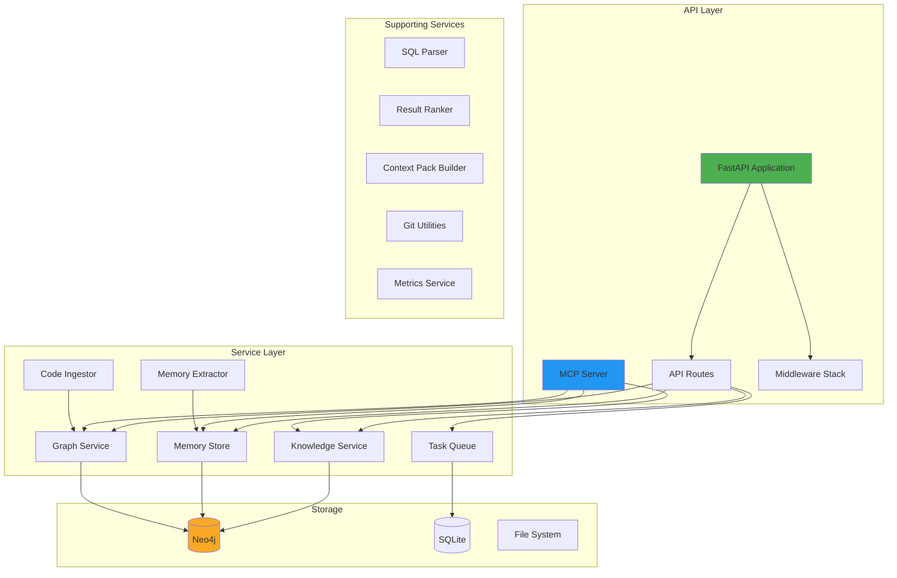
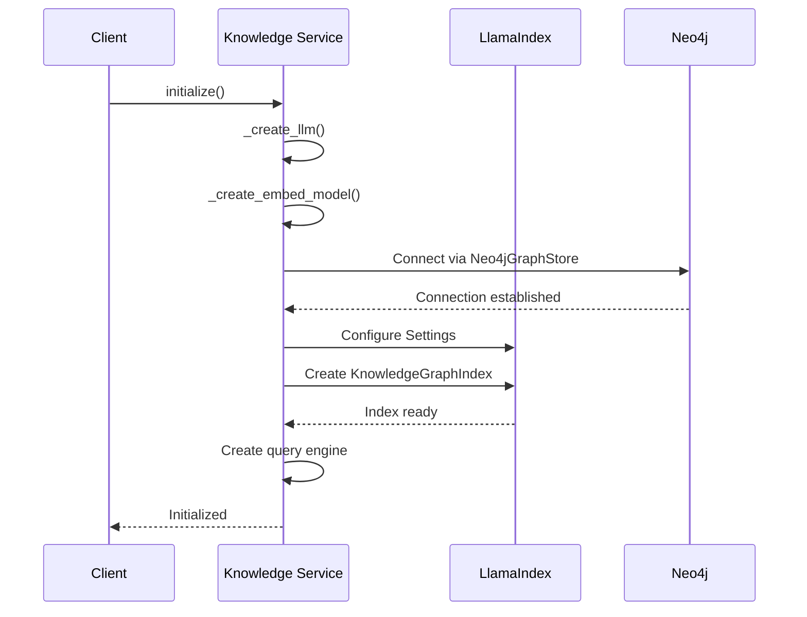
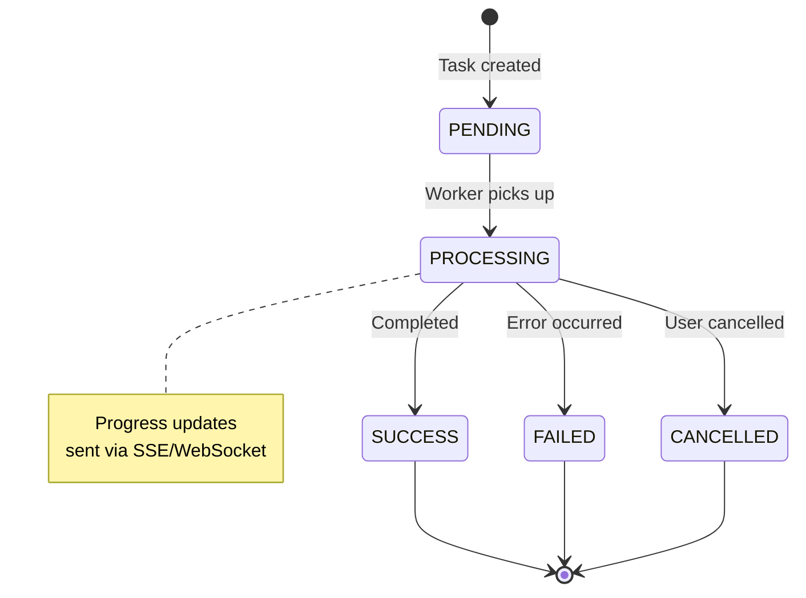
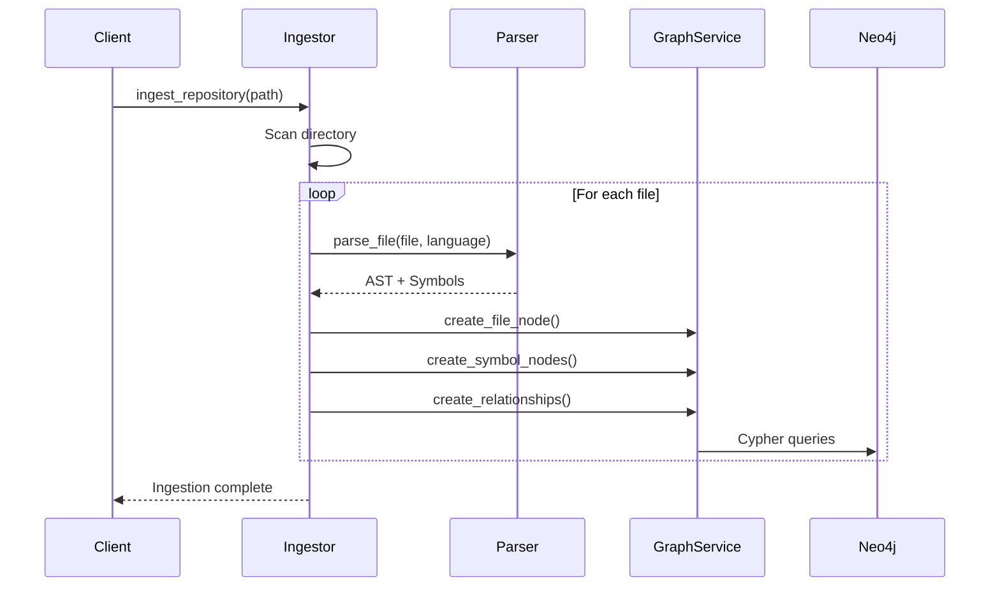
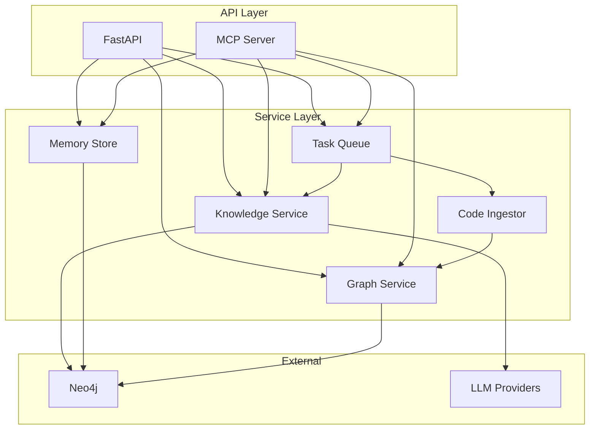

# System Components

## Table of Contents

- [Overview](#overview)
- [API Layer Components](#api-layer-components)
- [Service Layer Components](#service-layer-components)
- [Storage Components](#storage-components)
- [Utility Components](#utility-components)
- [MCP Server Components](#mcp-server-components)
- [Component Dependencies](#component-dependencies)

## Overview

The Code Graph Knowledge System consists of multiple specialized components organized in layers. This document provides detailed descriptions of each component, their responsibilities, interfaces, and interactions.



## API Layer Components

### FastAPI Application

**File**: `main.py`, `core/app.py`

**Purpose**: Main web server providing RESTful API endpoints

**Key Responsibilities**:
- HTTP request handling
- Route management
- Middleware processing
- Static file serving
- API documentation (OpenAPI/Swagger)

**Configuration**:
```python
app = FastAPI(
    title="Code Graph Knowledge Service",
    version="1.0.0",
    lifespan=lifespan,  # Startup/shutdown hooks
    docs_url="/docs",
    redoc_url="/redoc"
)
```

**Dependencies**:
- All service layer components
- Configuration settings
- Middleware stack
- Exception handlers

**Startup Sequence**:
1. Load configuration from environment
2. Initialize logging system
3. Initialize all services via lifespan manager
4. Setup middleware
5. Register routes
6. Mount static files
7. Integrate monitoring UI (if enabled)

**Shutdown Sequence**:
1. Stop accepting new requests
2. Stop task queue
3. Close Memory Store
4. Close Knowledge Service
5. Close database connections

### API Routes

**File**: `core/routes.py`, `api/*.py`

**Purpose**: Organize and register all API endpoints

**Route Modules**:

#### 1. Main Routes (`api/routes.py`)
```python
# Health check
GET /api/v1/health

# Knowledge base operations
POST /api/v1/knowledge/query
POST /api/v1/knowledge/search
POST /api/v1/documents/add
POST /api/v1/documents/file
POST /api/v1/documents/directory

# SQL parsing
POST /api/v1/sql/parse
POST /api/v1/sql/schema/upload

# Code graph
POST /api/v1/code/ingest
POST /api/v1/code/search
POST /api/v1/code/related
POST /api/v1/code/impact
POST /api/v1/code/context-pack
```

#### 2. Memory Routes (`api/memory_routes.py`)
```python
# Memory management
POST /api/v1/memory/add
POST /api/v1/memory/search
GET /api/v1/memory/{memory_id}
PUT /api/v1/memory/{memory_id}
DELETE /api/v1/memory/{memory_id}
POST /api/v1/memory/supersede
GET /api/v1/memory/project/{project_id}/summary

# Memory extraction (v0.7)
POST /api/v1/memory/extract/conversation
POST /api/v1/memory/extract/commit
POST /api/v1/memory/extract/comments
POST /api/v1/memory/suggest
POST /api/v1/memory/extract/batch
```

#### 3. Task Routes (`api/task_routes.py`)
```python
# Task management
GET /api/v1/tasks/{task_id}
GET /api/v1/tasks
POST /api/v1/tasks/{task_id}/cancel
GET /api/v1/queue/stats
```

#### 4. SSE Routes (`api/sse_routes.py`)
```python
# Server-Sent Events for real-time updates
GET /api/v1/sse/task/{task_id}
GET /api/v1/sse/tasks
GET /api/v1/sse/stats
```

#### 5. WebSocket Routes (`api/websocket_routes.py`)
```python
# WebSocket connections
WS /api/v1/ws/task/{task_id}
```

**Request/Response Models**:
```python
# Example: Document addition
class DocumentAddRequest(BaseModel):
    content: str
    title: str = "Untitled"
    metadata: Optional[Dict[str, Any]] = None

class DocumentAddResponse(BaseModel):
    success: bool
    document_id: Optional[str] = None
    message: str
    error: Optional[str] = None
```

### Middleware Stack

**File**: `core/middleware.py`

**Purpose**: Process all requests/responses with cross-cutting concerns

**Middleware Components**:

#### 1. CORS Middleware
```python
CORSMiddleware(
    allow_origins=settings.cors_origins,
    allow_credentials=True,
    allow_methods=["*"],
    allow_headers=["*"]
)
```

**Purpose**: Handle cross-origin requests for web clients

#### 2. GZip Middleware
```python
GZipMiddleware(minimum_size=1000)
```

**Purpose**: Compress responses for bandwidth optimization

#### 3. Request Logging Middleware
```python
@app.middleware("http")
async def log_requests(request: Request, call_next):
    start_time = time.time()
    response = await call_next(request)
    duration = time.time() - start_time
    logger.info(f"{request.method} {request.url.path} {response.status_code} {duration:.3f}s")
    return response
```

**Purpose**: Log all HTTP requests with timing information

#### 4. Error Handling Middleware
```python
@app.exception_handler(Exception)
async def global_exception_handler(request: Request, exc: Exception):
    logger.error(f"Unhandled exception: {exc}")
    return JSONResponse(
        status_code=500,
        content={"detail": "Internal server error"}
    )
```

**Purpose**: Catch and handle all uncaught exceptions

### Lifespan Manager

**File**: `core/lifespan.py`

**Purpose**: Manage application startup and shutdown lifecycle

**Initialization Sequence**:
```python
@asynccontextmanager
async def lifespan(app: FastAPI):
    # Startup
    logger.info("Starting services...")

    # 1. Initialize Neo4j Knowledge Service
    await neo4j_knowledge_service.initialize()

    # 2. Initialize Memory Store
    await memory_store.initialize()

    # 3. Initialize Task Processors
    processor_registry.initialize_default_processors(neo4j_knowledge_service)

    # 4. Start Task Queue
    await task_queue.start()

    yield

    # Shutdown
    await task_queue.stop()
    await memory_store.close()
    await neo4j_knowledge_service.close()
```

**Design Pattern**: Context manager ensures proper cleanup even on errors

## Service Layer Components

### Knowledge Service

**File**: `services/neo4j_knowledge_service.py`

**Purpose**: Primary service for knowledge graph operations using LlamaIndex

**Key Capabilities**:
- Document processing and chunking
- Vector embedding generation
- Knowledge graph construction
- RAG-based query answering
- Semantic similarity search

**Architecture**:
```python
class Neo4jKnowledgeService:
    def __init__(self):
        self.graph_store = None          # Neo4j graph store
        self.knowledge_index = None      # LlamaIndex KnowledgeGraphIndex
        self.query_engine = None         # RAG query engine
        self._initialized = False
```

**Initialization Flow**:


**Core Methods**:

#### 1. Document Addition
```python
async def add_document(
    self,
    content: str,
    title: str = "Untitled",
    metadata: Optional[Dict[str, Any]] = None
) -> Dict[str, Any]:
    """Add document to knowledge graph"""
    # 1. Create LlamaIndex Document
    document = Document(text=content, metadata={...})

    # 2. Insert into index (creates nodes, embeddings, relationships)
    await asyncio.to_thread(self.knowledge_index.insert, document)

    # 3. Return result with document ID
    return {"success": True, "document_id": doc_id}
```

#### 2. Query Processing (RAG)
```python
async def query(
    self,
    question: str,
    top_k: int = 5
) -> Dict[str, Any]:
    """Query knowledge base with RAG"""
    # 1. Use query engine to retrieve relevant context
    # 2. Generate answer using LLM with context
    response = await asyncio.to_thread(
        self.query_engine.query,
        question
    )

    # 3. Return answer with source nodes
    return {
        "success": True,
        "answer": str(response),
        "sources": [node.metadata for node in response.source_nodes]
    }
```

#### 3. Semantic Search
```python
async def search_similar(
    self,
    query: str,
    top_k: int = 5
) -> Dict[str, Any]:
    """Find similar documents using vector search"""
    # 1. Generate query embedding
    # 2. Search Neo4j vector index
    # 3. Return ranked results
```

**LLM Provider Support**:
```python
def _create_llm(self):
    provider = settings.llm_provider

    if provider == "ollama":
        return Ollama(model=settings.ollama_model, ...)
    elif provider == "openai":
        return OpenAI(model=settings.openai_model, ...)
    elif provider == "gemini":
        return Gemini(model=settings.gemini_model, ...)
    elif provider == "openrouter":
        return OpenRouter(model=settings.openrouter_model, ...)
```

**Embedding Model Support**:
```python
def _create_embed_model(self):
    provider = settings.embedding_provider

    if provider == "ollama":
        return OllamaEmbedding(model_name=settings.ollama_embedding_model)
    elif provider == "openai":
        return OpenAIEmbedding(model=settings.openai_embedding_model)
    elif provider == "gemini":
        return GeminiEmbedding(model_name=settings.gemini_embedding_model)
    elif provider == "huggingface":
        return HuggingFaceEmbedding(model_name=settings.huggingface_embedding_model)
```

**Configuration**:
```python
# Global LlamaIndex settings
Settings.llm = self._create_llm()
Settings.embed_model = self._create_embed_model()
Settings.chunk_size = settings.chunk_size
Settings.chunk_overlap = settings.chunk_overlap
Settings.node_parser = SimpleNodeParser.from_defaults()
```

### Memory Store

**File**: `services/memory_store.py`

**Purpose**: Persistent project knowledge management for AI agents

**Memory Types**:
```python
MemoryType = Literal[
    "decision",      # Architecture choices, tech decisions
    "preference",    # Coding styles, tool preferences
    "experience",    # Problems and solutions
    "convention",    # Team rules, naming conventions
    "plan",          # Future improvements, TODOs
    "note"           # Other important information
]
```

**Data Model**:
```python
class Memory:
    id: str                          # Unique identifier
    project_id: str                  # Project namespace
    memory_type: MemoryType          # Type of memory
    title: str                       # Short description
    content: str                     # Main content
    reason: Optional[str]            # Rationale/context
    importance: float                # 0.0-1.0 score
    tags: List[str]                  # Categorization tags
    created_at: datetime             # Creation timestamp
    updated_at: datetime             # Last update
    is_active: bool                  # Soft delete flag
    superseded_by: Optional[str]     # Replacement memory ID
```

**Graph Schema**:
```cypher
// Nodes
(:Memory {
    id: string,
    project_id: string,
    memory_type: string,
    title: string,
    content: string,
    reason: string,
    importance: float,
    tags: [string],
    created_at: datetime,
    updated_at: datetime,
    is_active: boolean,
    superseded_by: string
})

(:Project {
    id: string,
    name: string,
    created_at: datetime
})

// Relationships
(Memory)-[:BELONGS_TO]->(Project)
(Memory)-[:RELATES_TO]->(Memory)
(Memory)-[:SUPERSEDES]->(Memory)
```

**Core Operations**:

#### 1. Add Memory
```python
async def add_memory(
    self,
    project_id: str,
    memory_type: MemoryType,
    title: str,
    content: str,
    reason: Optional[str] = None,
    importance: float = 0.5,
    tags: Optional[List[str]] = None
) -> Dict[str, Any]:
    """Add new project memory"""
    # 1. Generate unique ID
    # 2. Create Memory node in Neo4j
    # 3. Link to Project
    # 4. Create fulltext indexes
    # 5. Return memory details
```

#### 2. Search Memories
```python
async def search_memories(
    self,
    project_id: str,
    query: Optional[str] = None,
    memory_type: Optional[MemoryType] = None,
    tags: Optional[List[str]] = None,
    min_importance: float = 0.0,
    limit: int = 10
) -> List[Dict[str, Any]]:
    """Search project memories with filters"""
    # 1. Build Cypher query with filters
    # 2. Use fulltext search if query provided
    # 3. Filter by type, tags, importance
    # 4. Order by relevance and importance
    # 5. Return ranked results
```

#### 3. Supersede Memory
```python
async def supersede_memory(
    self,
    old_memory_id: str,
    new_title: str,
    new_content: str,
    ...
) -> Dict[str, Any]:
    """Replace old memory with new version"""
    # 1. Create new memory
    # 2. Mark old memory as superseded
    # 3. Create SUPERSEDES relationship
    # 4. Maintain history chain
```

**Indexes**:
```cypher
// Constraints
CREATE CONSTRAINT memory_id_unique IF NOT EXISTS
FOR (m:Memory) REQUIRE m.id IS UNIQUE;

// Fulltext search
CREATE FULLTEXT INDEX memory_search IF NOT EXISTS
FOR (m:Memory) ON EACH [m.title, m.content, m.reason, m.tags];
```

### Graph Service

**File**: `services/graph_service.py`

**Purpose**: Direct Neo4j graph database operations

**Key Capabilities**:
- Raw Cypher query execution
- Code graph management
- Schema operations
- Batch operations
- Transaction management

**Architecture**:
```python
class Neo4jGraphService:
    def __init__(self):
        self.driver = None           # Neo4j driver
        self._connected = False
```

**Core Methods**:

#### 1. Execute Query
```python
async def execute_query(
    self,
    cypher: str,
    parameters: Optional[Dict[str, Any]] = None
) -> GraphQueryResult:
    """Execute Cypher query and return results"""
    with self.driver.session(database=settings.neo4j_database) as session:
        result = session.run(cypher, parameters)
        return self._process_result(result)
```

#### 2. Create Nodes
```python
def create_node(
    self,
    labels: List[str],
    properties: Dict[str, Any]
) -> GraphNode:
    """Create graph node"""
    cypher = f"""
    CREATE (n:{':'.join(labels)})
    SET n = $properties
    RETURN n
    """
    # Execute and return node
```

#### 3. Create Relationships
```python
def create_relationship(
    self,
    start_node_id: str,
    end_node_id: str,
    relationship_type: str,
    properties: Optional[Dict[str, Any]] = None
) -> GraphRelationship:
    """Create relationship between nodes"""
    cypher = """
    MATCH (a), (b)
    WHERE a.id = $start_id AND b.id = $end_id
    CREATE (a)-[r:$rel_type]->(b)
    SET r = $properties
    RETURN r
    """
    # Execute and return relationship
```

**Code Graph Schema**:
```cypher
// Repository structure
(:Repo {id: string, name: string, path: string})
(:File {repoId: string, path: string, lang: string, content: string})
(:Symbol {id: string, name: string, type: string, line: int})

// Code entities
(:Function {id: string, name: string, params: [string], returns: string})
(:Class {id: string, name: string, methods: [string]})
(:Table {id: string, name: string, columns: [string]})

// Relationships
(File)-[:BELONGS_TO]->(Repo)
(Symbol)-[:DEFINED_IN]->(File)
(Symbol)-[:CALLS]->(Symbol)
(Symbol)-[:INHERITS]->(Symbol)
(Symbol)-[:USES]->(Symbol)
```

### Task Queue

**File**: `services/task_queue.py`

**Purpose**: Asynchronous background task processing with persistence

**Design Pattern**: Producer-Consumer with SQLite persistence

**Architecture**:
```python
class TaskQueue:
    def __init__(self, max_concurrent_tasks: int = 3):
        self.max_concurrent_tasks = max_concurrent_tasks
        self.tasks: Dict[str, TaskResult] = {}           # In-memory cache
        self.running_tasks: Dict[str, asyncio.Task] = {} # Active tasks
        self.task_semaphore = asyncio.Semaphore(max_concurrent_tasks)
        self._storage = None                              # SQLite storage
        self._worker_id = str(uuid.uuid4())              # Worker identity
```

**Task Lifecycle**:


**Task Status**:
```python
class TaskStatus(Enum):
    PENDING = "pending"         # Queued, not started
    PROCESSING = "processing"   # Currently running
    SUCCESS = "success"         # Completed successfully
    FAILED = "failed"          # Error occurred
    CANCELLED = "cancelled"    # User cancelled
```

**Task Result**:
```python
@dataclass
class TaskResult:
    task_id: str
    status: TaskStatus
    progress: float = 0.0                    # 0.0 to 1.0
    message: str = ""                        # Status message
    result: Optional[Dict[str, Any]] = None  # Final result
    error: Optional[str] = None              # Error details
    created_at: datetime
    started_at: Optional[datetime] = None
    completed_at: Optional[datetime] = None
    metadata: Dict[str, Any]                 # Task-specific data
```

**Core Operations**:

#### 1. Submit Task
```python
async def submit_task(
    self,
    task_func: Callable,
    *args,
    task_type: str = "generic",
    **kwargs
) -> str:
    """Submit new task for processing"""
    # 1. Generate task ID
    task_id = str(uuid.uuid4())

    # 2. Create TaskResult
    task_result = TaskResult(
        task_id=task_id,
        status=TaskStatus.PENDING,
        metadata={"type": task_type}
    )

    # 3. Store in SQLite
    await self._storage.store_task(task_result)

    # 4. Cache in memory
    self.tasks[task_id] = task_result

    # 5. Worker will pick up automatically
    return task_id
```

#### 2. Process Tasks (Worker)
```python
async def _process_pending_tasks(self):
    """Background worker to process pending tasks"""
    while True:
        try:
            # 1. Get pending tasks from SQLite
            pending = await self._storage.get_pending_tasks(limit=10)

            # 2. Process each task
            for task in pending:
                if len(self.running_tasks) < self.max_concurrent_tasks:
                    await self._execute_task(task)

            # 3. Wait before next poll
            await asyncio.sleep(1)

        except asyncio.CancelledError:
            break
```

#### 3. Execute Task
```python
async def _execute_task(self, task: TaskResult):
    """Execute single task with error handling"""
    async with self.task_semaphore:
        try:
            # 1. Update status to PROCESSING
            task.status = TaskStatus.PROCESSING
            task.started_at = datetime.now()
            await self._storage.update_task_status(task.task_id, task.status)

            # 2. Get processor for task type
            processor = processor_registry.get_processor(task.metadata["type"])

            # 3. Execute processor
            result = await processor.process(task)

            # 4. Update status to SUCCESS
            task.status = TaskStatus.SUCCESS
            task.result = result
            task.completed_at = datetime.now()

        except Exception as e:
            # Update status to FAILED
            task.status = TaskStatus.FAILED
            task.error = str(e)

        finally:
            # Save to storage
            await self._storage.update_task(task)
```

**Progress Tracking**:
```python
async def update_progress(
    self,
    task_id: str,
    progress: float,
    message: str
):
    """Update task progress"""
    task = self.tasks.get(task_id)
    if task:
        task.progress = progress
        task.message = message
        await self._storage.update_task(task)

        # Notify SSE/WebSocket listeners
        await self._notify_listeners(task_id, task)
```

### Code Ingestor

**File**: `services/code_ingestor.py`

**Purpose**: Parse and ingest code repositories into graph structure

**Supported Languages**:
- Python
- JavaScript/TypeScript
- Java
- Go
- C/C++
- SQL

**Ingestion Process**:


**Core Methods**:

#### 1. Ingest Repository
```python
async def ingest_repository(
    self,
    repo_path: str,
    repo_name: Optional[str] = None
) -> Dict[str, Any]:
    """Ingest entire code repository"""
    # 1. Create Repo node
    # 2. Walk directory tree
    # 3. Parse each file
    # 4. Create graph structure
    # 5. Return statistics
```

#### 2. Parse File
```python
def parse_file(self, file_path: str, language: str) -> ParseResult:
    """Parse code file and extract symbols"""
    if language == "python":
        return self._parse_python(file_path)
    elif language == "javascript":
        return self._parse_javascript(file_path)
    # ... other languages
```

#### 3. Extract Symbols
```python
def _parse_python(self, file_path: str) -> ParseResult:
    """Parse Python file using AST"""
    import ast

    with open(file_path) as f:
        tree = ast.parse(f.read())

    symbols = []
    for node in ast.walk(tree):
        if isinstance(node, ast.FunctionDef):
            symbols.append({
                "type": "function",
                "name": node.name,
                "line": node.lineno
            })
        elif isinstance(node, ast.ClassDef):
            symbols.append({
                "type": "class",
                "name": node.name,
                "line": node.lineno
            })

    return ParseResult(symbols=symbols, relationships=[])
```

### Memory Extractor

**File**: `services/memory_extractor.py`

**Purpose**: Automatically extract memories from various sources (v0.7)

**Extraction Sources**:
1. Conversation analysis
2. Git commit mining
3. Code comment extraction
4. Query/answer analysis
5. Batch repository analysis

**Core Methods**:

#### 1. Extract from Conversation
```python
async def extract_from_conversation(
    self,
    project_id: str,
    conversation: List[Dict[str, str]],
    auto_save: bool = False
) -> List[Dict[str, Any]]:
    """Extract memories from AI conversation"""
    # 1. Format conversation for LLM
    # 2. Use LLM to identify decisions, learnings
    # 3. Generate memory objects
    # 4. Optionally auto-save high-confidence memories
```

#### 2. Extract from Git Commit
```python
async def extract_from_git_commit(
    self,
    project_id: str,
    commit_sha: str,
    commit_message: str,
    changed_files: List[str],
    auto_save: bool = False
) -> List[Dict[str, Any]]:
    """Extract memories from git commit"""
    # 1. Analyze commit message
    # 2. Analyze changed files
    # 3. Use LLM to extract decisions/experiences
    # 4. Generate memories with context
```

#### 3. Extract from Code Comments
```python
async def extract_from_code_comments(
    self,
    project_id: str,
    file_path: str
) -> List[Dict[str, Any]]:
    """Mine TODO, FIXME, NOTE markers"""
    # 1. Parse file for comment markers
    # 2. Extract context around markers
    # 3. Classify as plan/note/experience
    # 4. Generate memory objects
```

### Task Processors

**File**: `services/task_processors.py`

**Purpose**: Implement specific task processing logic

**Processor Registry**:
```python
class ProcessorRegistry:
    def __init__(self):
        self.processors: Dict[str, TaskProcessor] = {}

    def register(self, task_type: str, processor: TaskProcessor):
        """Register processor for task type"""
        self.processors[task_type] = processor

    def get_processor(self, task_type: str) -> TaskProcessor:
        """Get processor for task type"""
        return self.processors.get(task_type)
```

**Built-in Processors**:

#### 1. Document Processor
```python
class DocumentProcessor(TaskProcessor):
    async def process(self, task: TaskResult) -> Dict[str, Any]:
        """Process document ingestion task"""
        # 1. Read document from file/content
        # 2. Call knowledge service
        # 3. Update progress
        # 4. Return result
```

#### 2. Directory Processor
```python
class DirectoryProcessor(TaskProcessor):
    async def process(self, task: TaskResult) -> Dict[str, Any]:
        """Process batch directory ingestion"""
        # 1. List files in directory
        # 2. Filter by patterns
        # 3. Process each file
        # 4. Update progress incrementally
        # 5. Return summary
```

#### 3. Code Ingestion Processor
```python
class CodeIngestionProcessor(TaskProcessor):
    async def process(self, task: TaskResult) -> Dict[str, Any]:
        """Process code repository ingestion"""
        # 1. Call code ingestor
        # 2. Track progress per file
        # 3. Return ingestion statistics
```

## Storage Components

### Neo4j Graph Database

**Purpose**: Primary storage for all graph data

**Node Types**:
```cypher
// Knowledge graph
:Document, :Entity, :Chunk

// Memory store
:Memory, :Project

// Code graph
:Repo, :File, :Symbol, :Function, :Class, :Table

// SQL schema
:Database, :Table, :Column
```

**Indexes**:
```cypher
// Constraints
CREATE CONSTRAINT FOR (d:Document) REQUIRE d.id IS UNIQUE;
CREATE CONSTRAINT FOR (m:Memory) REQUIRE m.id IS UNIQUE;
CREATE CONSTRAINT FOR (r:Repo) REQUIRE r.id IS UNIQUE;

// Fulltext indexes
CREATE FULLTEXT INDEX memory_search FOR (m:Memory)
    ON EACH [m.title, m.content, m.reason, m.tags];

CREATE FULLTEXT INDEX file_text FOR (f:File)
    ON EACH [f.path, f.lang];

// Vector index
CALL db.index.vector.createNodeIndex(
    'knowledge_vectors',
    'Document',
    'embedding',
    1536,
    'cosine'
);
```

### SQLite Task Storage

**File**: `services/task_storage.py`

**Purpose**: Persistent storage for task queue

**Schema**:
```sql
CREATE TABLE tasks (
    task_id TEXT PRIMARY KEY,
    status TEXT NOT NULL,
    task_type TEXT NOT NULL,
    progress REAL DEFAULT 0.0,
    message TEXT,
    result TEXT,  -- JSON
    error TEXT,
    metadata TEXT,  -- JSON
    created_at TEXT NOT NULL,
    started_at TEXT,
    completed_at TEXT,
    worker_id TEXT,
    locked_at TEXT
);

CREATE INDEX idx_status ON tasks(status);
CREATE INDEX idx_created ON tasks(created_at);
CREATE INDEX idx_worker ON tasks(worker_id);
```

**Concurrency Control**:
```python
async def get_pending_tasks(self, limit: int = 10) -> List[TaskResult]:
    """Get and lock pending tasks"""
    # Use SELECT ... FOR UPDATE to prevent race conditions
    query = """
    UPDATE tasks
    SET worker_id = ?, locked_at = ?
    WHERE task_id IN (
        SELECT task_id FROM tasks
        WHERE status = 'pending'
        AND (locked_at IS NULL OR locked_at < datetime('now', '-5 minutes'))
        ORDER BY created_at
        LIMIT ?
    )
    RETURNING *
    """
```

## Utility Components

### SQL Parser

**File**: `services/sql_parser.py`

**Purpose**: Parse SQL queries and extract metadata

**Capabilities**:
- SQL syntax parsing
- Table/column extraction
- Query type detection
- Dependency analysis

### Result Ranker

**File**: `services/ranker.py`

**Purpose**: Rank search results by relevance

**Ranking Factors**:
- Vector similarity score
- Graph distance
- Metadata match
- Recency

### Context Pack Builder

**File**: `services/pack_builder.py`

**Purpose**: Generate context packages for AI tools

**Output Format**:
```python
{
    "files": [
        {"path": "src/main.py", "content": "...", "relevance": 0.95},
        {"path": "src/utils.py", "content": "...", "relevance": 0.87}
    ],
    "symbols": [
        {"name": "process_data", "type": "function", "file": "src/main.py"}
    ],
    "relationships": [
        {"from": "main.py", "to": "utils.py", "type": "imports"}
    ],
    "metadata": {
        "total_files": 2,
        "total_lines": 450,
        "languages": ["python"]
    }
}
```

### Git Utilities

**File**: `services/git_utils.py`

**Purpose**: Git repository operations

**Capabilities**:
- Commit history retrieval
- Diff extraction
- Branch operations
- File change tracking

## MCP Server Components

### MCP Server Main

**File**: `mcp_server.py`

**Purpose**: Model Context Protocol server using official SDK

**Architecture**:
```python
# Official MCP SDK
from mcp.server import Server
from mcp.server.models import InitializationOptions

app = Server("code-graph-knowledge")

# Tool registration
@app.list_tools()
async def list_tools() -> list[Tool]:
    return get_tool_definitions()

# Tool execution
@app.call_tool()
async def call_tool(name: str, arguments: dict) -> Sequence[TextContent]:
    # Route to appropriate handler
    handler = tool_handlers.get(name)
    result = await handler(arguments)
    return [TextContent(type="text", text=format_result(result))]
```

**Tool Categories** (30 tools total):

#### 1. Knowledge Base Tools (5)
- `query_knowledge`: RAG-based Q&A
- `search_similar_nodes`: Vector similarity search
- `add_document`: Add document from content
- `add_file`: Add document from file
- `add_directory`: Batch directory processing

#### 2. Code Graph Tools (4)
- `code_graph_ingest_repo`: Ingest repository
- `code_graph_related`: Find related code
- `code_graph_impact`: Impact analysis
- `context_pack`: Generate AI context

#### 3. Memory Tools (7)
- `add_memory`: Create memory
- `search_memories`: Search with filters
- `get_memory`: Get by ID
- `update_memory`: Modify memory
- `delete_memory`: Soft delete
- `supersede_memory`: Replace with new version
- `get_project_summary`: Project overview

#### 4. Memory Extraction Tools (5)
- `extract_from_conversation`: Analyze conversations
- `extract_from_git_commit`: Mine commits
- `extract_from_code_comments`: Extract from code
- `suggest_memory_from_query`: Suggest from Q&A
- `batch_extract_from_repository`: Batch analysis

#### 5. Task Tools (6)
- `get_task_status`: Check task status
- `watch_task`: Monitor single task
- `watch_tasks`: Monitor multiple tasks
- `list_tasks`: List all tasks
- `cancel_task`: Cancel task
- `get_queue_stats`: Queue statistics

#### 6. System Tools (3)
- `get_graph_schema`: Neo4j schema
- `get_statistics`: System stats
- `clear_knowledge_base`: Clear data

### MCP Tool Handlers

**File**: `mcp_tools/*.py`

**Modular Organization**:
```
mcp_tools/
├── __init__.py              # Exports
├── tool_definitions.py      # Tool schemas
├── knowledge_handlers.py    # Knowledge operations
├── code_handlers.py         # Code graph operations
├── memory_handlers.py       # Memory operations
├── task_handlers.py         # Task operations
├── system_handlers.py       # System operations
├── resources.py             # MCP resources
├── prompts.py              # MCP prompts
└── utils.py                # Shared utilities
```

**Handler Pattern**:
```python
async def handle_query_knowledge(arguments: dict) -> dict:
    """Handle knowledge query request"""
    # 1. Validate arguments
    question = arguments.get("question")
    if not question:
        return {"success": False, "error": "Question required"}

    # 2. Call service
    result = await neo4j_knowledge_service.query(
        question=question,
        top_k=arguments.get("top_k", 5)
    )

    # 3. Return result
    return result
```

## Component Dependencies

### Dependency Graph



### Initialization Order

Critical for avoiding circular dependencies:

```python
# 1. Configuration (no dependencies)
from config import settings

# 2. Storage layer (no app dependencies)
neo4j_connection = Neo4jGraphStore(...)

# 3. Service layer (depends on storage)
knowledge_service = Neo4jKnowledgeService()
memory_store = MemoryStore()
graph_service = Neo4jGraphService()

# 4. Processors (depend on services)
processor_registry.initialize_default_processors(knowledge_service)

# 5. Task queue (depends on processors)
await task_queue.start()

# 6. API layer (depends on all services)
app = create_app()
```

### Service Communication Patterns

**1. Direct Method Calls** (within same process):
```python
# FastAPI route calls service
result = await knowledge_service.query(question)
```

**2. Task Queue** (async operations):
```python
# Submit task for background processing
task_id = await task_queue.submit_task(
    task_func=process_large_document,
    document_path=path
)
```

**3. Event Streaming** (real-time updates):
```python
# SSE for task progress
async def task_progress_stream(task_id: str):
    while True:
        task = task_queue.get_task(task_id)
        yield f"data: {json.dumps(task.to_dict())}\n\n"
        await asyncio.sleep(1)
```

## Component Configuration

All components are configured via environment variables:

```python
# config.py
class Settings(BaseSettings):
    # Database
    neo4j_uri: str = "bolt://localhost:7687"
    neo4j_username: str = "neo4j"
    neo4j_password: str = "password"

    # LLM
    llm_provider: str = "ollama"
    ollama_model: str = "llama2"

    # Timeouts
    connection_timeout: int = 30
    operation_timeout: int = 120

    class Config:
        env_file = ".env"
```

Components access configuration:
```python
from config import settings

# Use in service
self.timeout = settings.operation_timeout
```

## Testing Components

Each component has corresponding tests:

```
tests/
├── test_neo4j_knowledge_service.py
├── test_memory_store.py
├── test_graph_service.py
├── test_task_queue.py
├── test_code_ingestor.py
└── test_mcp_handlers.py
```

**Test Patterns**:
```python
@pytest.mark.asyncio
async def test_add_memory():
    # Setup
    memory_store = MemoryStore()
    await memory_store.initialize()

    # Execute
    result = await memory_store.add_memory(
        project_id="test",
        memory_type="decision",
        title="Test decision",
        content="Test content"
    )

    # Assert
    assert result["success"] == True
    assert "memory_id" in result

    # Cleanup
    await memory_store.close()
```

## Conclusion

The component architecture follows these principles:

1. **Single Responsibility**: Each component has one clear purpose
2. **Loose Coupling**: Components communicate via interfaces
3. **High Cohesion**: Related functionality grouped together
4. **Dependency Injection**: Services injected rather than created
5. **Async-First**: All I/O operations are asynchronous
6. **Testability**: Components designed for easy testing

This modular design enables:
- Independent development and testing
- Easy component replacement
- Clear debugging and troubleshooting
- Scalable architecture evolution
