# Data Flow and Processing Pipelines

## Table of Contents

- [Overview](#overview)
- [Document Processing Pipeline](#document-processing-pipeline)
- [Knowledge Query Pipeline (RAG)](#knowledge-query-pipeline-rag)
- [Memory Management Pipeline](#memory-management-pipeline)
- [Code Graph Ingestion Pipeline](#code-graph-ingestion-pipeline)
- [Task Processing Pipeline](#task-processing-pipeline)
- [Real-time Update Pipeline](#real-time-update-pipeline)
- [MCP Request Pipeline](#mcp-request-pipeline)
- [Data Flow Patterns](#data-flow-patterns)

## Overview

This document describes how data flows through the Code Graph Knowledge System, detailing the processing pipelines for different operations. Understanding these flows is crucial for:

- Debugging issues
- Optimizing performance
- Extending functionality
- Understanding system behavior

### Core Data Types

```python
# Document content
Document = {
    "id": str,
    "content": str,
    "title": str,
    "metadata": dict,
    "embedding": List[float],  # Vector representation
    "chunks": List[str]        # Processed chunks
}

# Memory object
Memory = {
    "id": str,
    "project_id": str,
    "memory_type": str,        # decision/preference/experience/etc.
    "title": str,
    "content": str,
    "importance": float,
    "tags": List[str]
}

# Code symbol
Symbol = {
    "id": str,
    "name": str,
    "type": str,               # function/class/variable
    "file_path": str,
    "line": int,
    "relationships": List[dict]
}

# Task result
Task = {
    "task_id": str,
    "status": str,             # pending/processing/success/failed
    "progress": float,
    "result": dict,
    "error": Optional[str]
}
```

## Document Processing Pipeline

### Overview

Documents go through multiple stages from upload to queryable knowledge:

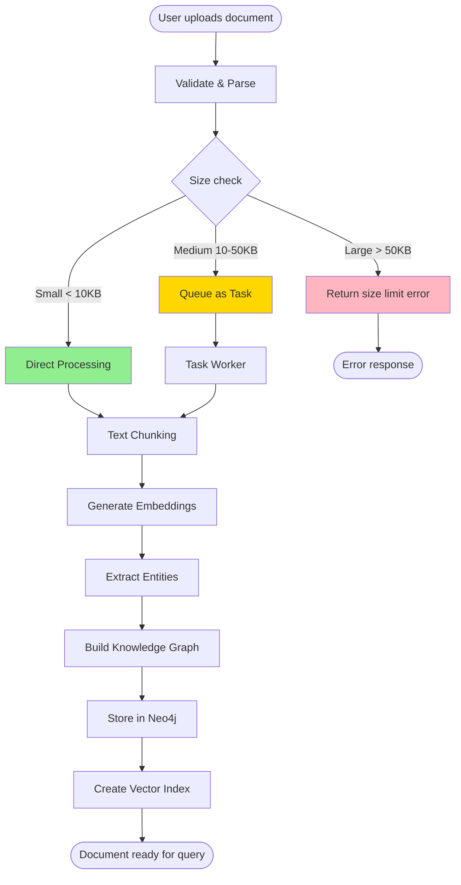

### Step-by-Step Flow

#### 1. Document Upload

**API Endpoint**: `POST /api/v1/documents/add`

```python
# Request
{
    "content": "This is the document content...",
    "title": "My Document",
    "metadata": {"author": "John", "topic": "AI"}
}
```

**Validation**:
```python
# Size check
content_size = len(content.encode('utf-8'))
if content_size > settings.max_document_size:
    raise HTTPException(413, "Document too large")

# Content check
if not content.strip():
    raise HTTPException(400, "Empty content")
```

#### 2. Routing Decision

Based on document size:

```python
if content_size < 10 * 1024:  # < 10KB
    # Direct synchronous processing
    result = await knowledge_service.add_document(content, title, metadata)
    return {"success": True, "document_id": result["document_id"]}

elif content_size < 50 * 1024:  # 10-50KB
    # Background task processing
    task_id = await submit_document_processing_task(content, title, metadata)
    return {"task_id": task_id, "message": "Processing in background"}

else:  # > 50KB
    # Reject - too large for direct processing
    return {"error": "Document too large, use file upload or directory processing"}
```

#### 3. Text Chunking

**LlamaIndex SimpleNodeParser**:

```python
from llama_index.core.node_parser import SimpleNodeParser

parser = SimpleNodeParser.from_defaults(
    chunk_size=512,        # Characters per chunk
    chunk_overlap=50       # Overlap between chunks
)

# Create chunks
chunks = parser.get_nodes_from_documents([document])
```

**Chunking Strategy**:
```
Original document (2000 chars):
"Text here... [chunk 1: 512 chars]
 ... [overlap: 50 chars]
 ... [chunk 2: 512 chars]
 ... [overlap: 50 chars]
 ... [chunk 3: remainder]"

Result: 3-4 chunks with overlapping context
```

**Why Chunking?**
- LLM context window limits
- Better semantic granularity
- Improved retrieval accuracy
- Parallel processing capability

#### 4. Embedding Generation

**Process**:
```python
# For each chunk
embedding = await embed_model.get_text_embedding(chunk.text)
# embedding: List[float] with length = vector_dimension (e.g., 1536)
```

**Provider-Specific**:

**Ollama** (local):
```python
from llama_index.embeddings.ollama import OllamaEmbedding

embed_model = OllamaEmbedding(
    model_name="nomic-embed-text",
    base_url="http://localhost:11434"
)
# Dimension: 768
```

**OpenAI**:
```python
from llama_index.embeddings.openai import OpenAIEmbedding

embed_model = OpenAIEmbedding(
    model="text-embedding-ada-002"
)
# Dimension: 1536
```

**Performance Considerations**:
- Batch embeddings when possible
- Cache embeddings for identical text
- Monitor API rate limits
- Use local models for privacy/cost

#### 5. Entity Extraction

**LlamaIndex Knowledge Graph Extraction**:

```python
# Configured in Knowledge Service
from llama_index.core import KnowledgeGraphIndex

# Extract entities and relationships
index = KnowledgeGraphIndex.from_documents(
    documents=[document],
    max_triplets_per_chunk=10
)
```

**Extracted Entities**:
```python
# Example triplets (subject, predicate, object)
[
    ("Python", "is_a", "Programming Language"),
    ("Python", "supports", "Object-Oriented Programming"),
    ("Django", "is_built_with", "Python")
]
```

**Entity Types**:
- Concepts (abstract ideas)
- Technologies (tools, frameworks)
- People (authors, contributors)
- Organizations (companies, projects)
- Events (releases, changes)

#### 6. Graph Construction

**Neo4j Storage**:

```cypher
// Create document node
CREATE (d:Document {
    id: $doc_id,
    title: $title,
    created_at: datetime(),
    metadata: $metadata
})

// Create chunk nodes with embeddings
CREATE (c:Chunk {
    id: $chunk_id,
    text: $chunk_text,
    embedding: $embedding_vector,
    chunk_index: $index
})
CREATE (d)-[:HAS_CHUNK]->(c)

// Create entity nodes
CREATE (e:Entity {
    id: $entity_id,
    name: $entity_name,
    type: $entity_type
})

// Create relationships
CREATE (c)-[:MENTIONS]->(e)
CREATE (e1)-[:RELATES_TO {type: $relation_type}]->(e2)
```

**Graph Structure**:
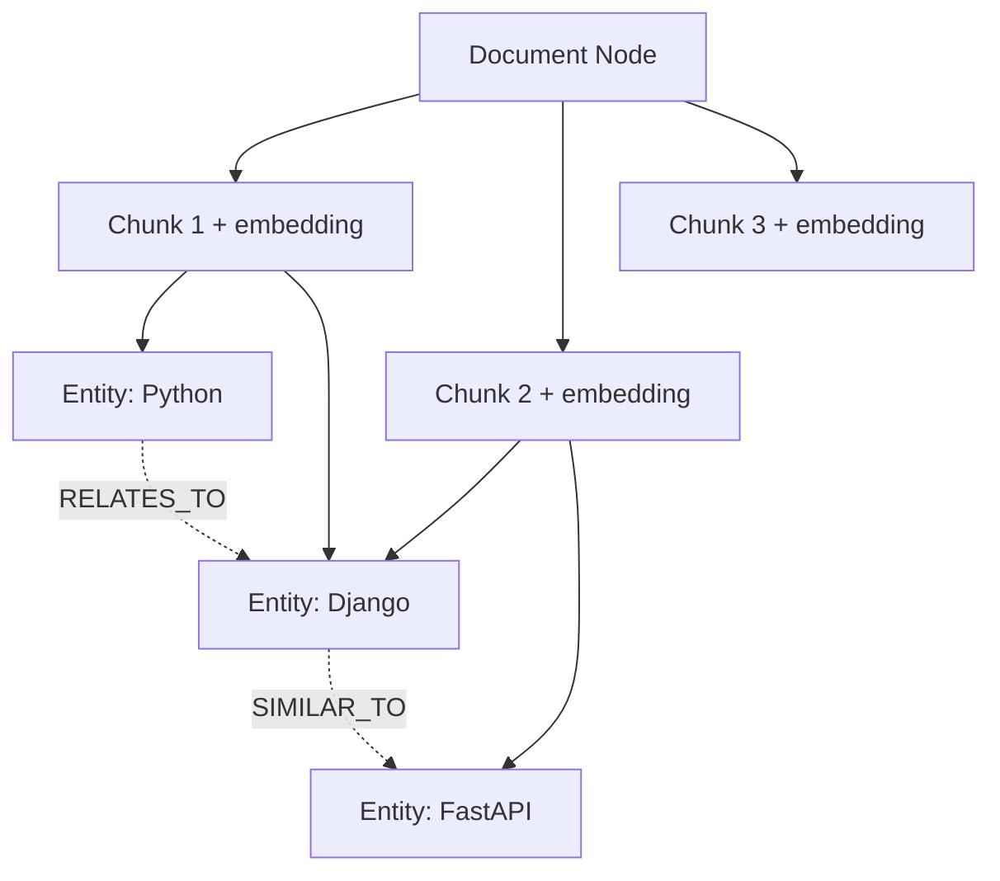

#### 7. Vector Index Creation

**Neo4j Vector Index**:

```cypher
// Create vector index (if not exists)
CALL db.index.vector.createNodeIndex(
    'knowledge_vectors',     // Index name
    'Chunk',                 // Node label
    'embedding',             // Property name
    1536,                    // Vector dimension
    'cosine'                 // Similarity metric
)
```

**Index Operations**:
- Automatically indexes new chunks
- Enables fast similarity search
- Supports approximate nearest neighbor (ANN)

#### 8. Completion

**Success Response**:
```python
{
    "success": true,
    "document_id": "doc_abc123",
    "chunks_created": 4,
    "entities_extracted": 12,
    "processing_time": 2.5  # seconds
}
```

### Error Handling

**Common Errors**:

```python
try:
    result = await knowledge_service.add_document(content, title)
except EmbeddingError as e:
    # LLM/embedding provider unavailable
    return {"error": "Embedding service unavailable", "retry": True}

except Neo4jError as e:
    # Database connection issue
    return {"error": "Database error", "retry": True}

except ValidationError as e:
    # Invalid input
    return {"error": str(e), "retry": False}

except TimeoutError as e:
    # Operation timeout
    return {"error": "Processing timeout", "retry": True}
```

## Knowledge Query Pipeline (RAG)

### Overview

The knowledge query path is orchestrated by a `Neo4jRAGPipeline` that is constructed during service initialization. The pipeline runs a deterministic sequence of components:

1. Resolve the query configuration (mode, graph/vector toggles, tool options).
2. Run `KnowledgeGraphRAGRetriever` for structured graph traversal.
3. Run `VectorIndexRetriever` against the Neo4j vector index.
4. Merge and deduplicate nodes before handing them to the `ResponseSynthesizer`.
5. Optionally execute registered `FunctionTool`/`ToolNode` hooks.
6. Return the synthesized answer together with pipeline traces and sources.

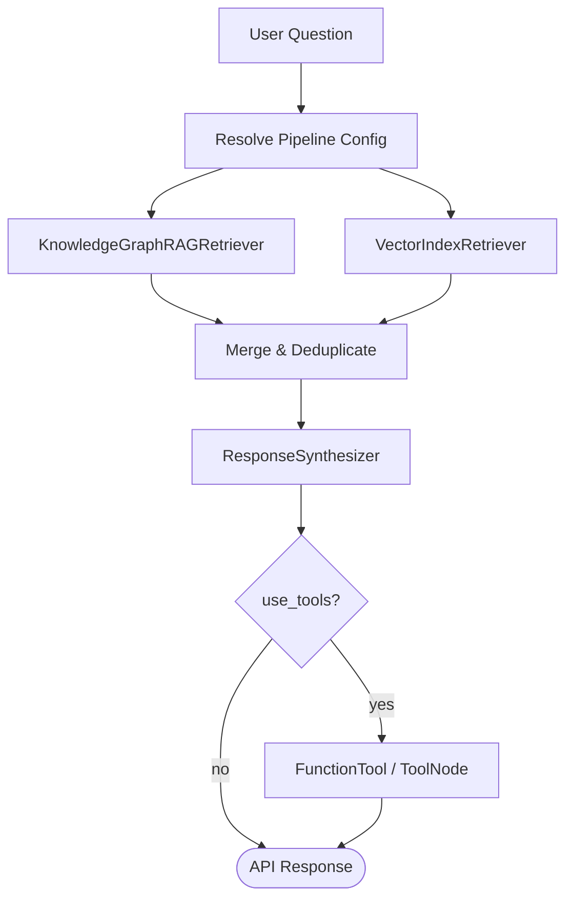

### Step-by-Step Flow

#### 1. Pipeline Configuration

**API Endpoint**: `POST /api/v1/knowledge/query`

```json
{
    "question": "How does authentication work in the system?",
    "mode": "hybrid",
    "use_graph": true,
    "use_vector": true,
    "use_tools": false,
    "top_k": 5,
    "graph_depth": 2
}
```

```python
config = service._resolve_pipeline_config(
    mode=payload.get("mode", "hybrid"),
    use_graph=payload.get("use_graph"),
    use_vector=payload.get("use_vector"),
    use_tools=payload.get("use_tools", False),
    top_k=payload.get("top_k"),
    graph_depth=payload.get("graph_depth"),
)
```

#### 2. Graph Retrieval

`KnowledgeGraphRAGRetriever` performs entity extraction and multi-hop traversal to fetch relevant triples and document chunks. Depth defaults to `2` but can be overridden per request.

```python
graph_nodes = KnowledgeGraphRAGRetriever(
    storage_context=storage_context,
    llm=Settings.llm,
    graph_traversal_depth=config.graph_depth,
).retrieve(QueryBundle(question))
```

#### 3. Vector Retrieval

`VectorIndexRetriever` queries the Neo4j vector index (loaded through `VectorStoreIndex.from_vector_store`) to find semantically similar chunks.

```python
vector_nodes = VectorIndexRetriever(
    vector_index,
    similarity_top_k=config.top_k,
).retrieve(QueryBundle(question))
```

#### 4. Response Synthesis

Retrieved nodes are merged and passed to the `ResponseSynthesizer`, which uses the configured LLM to generate the final response while keeping provenance.

```python
response = response_synthesizer.synthesize(QueryBundle(question), merged_nodes)
```

#### 5. Optional Tool Execution

If `use_tools` is `true`, the pipeline invokes registered tools to extend the answer (for example, to run follow-up analytics). Tool execution results are attached to the API response.

#### 6. Response Packaging

The API returns the synthesized answer along with full pipeline traces:

```json
{
  "answer": "The system uses JWT-based authentication...",
  "source_nodes": [...],
  "retrieved_nodes": [...],
  "pipeline_steps": [
    {"step": "graph_retrieval", "node_count": 3},
    {"step": "vector_retrieval", "node_count": 5}
  ],
  "tool_outputs": [],
  "config": {"graph": true, "vector": true, "tools": false}
}
```

## Memory Management Pipeline

### Overview

Memory lifecycle from creation to retrieval:

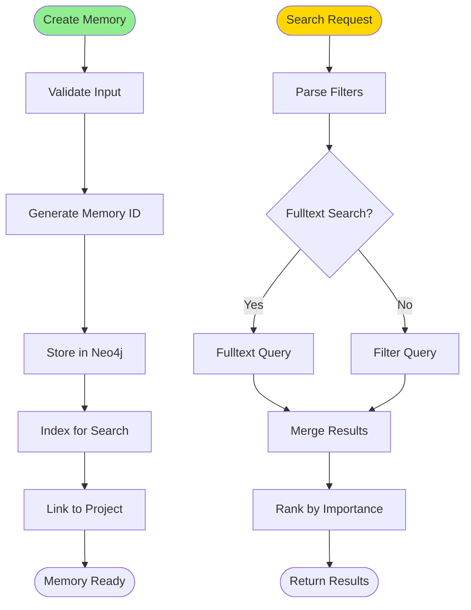

### Memory Creation Flow

#### 1. Manual Memory Creation

**API Endpoint**: `POST /api/v1/memory/add`

```python
{
    "project_id": "myapp",
    "memory_type": "decision",
    "title": "Use PostgreSQL for main database",
    "content": "Decided to use PostgreSQL instead of MySQL",
    "reason": "Need advanced JSON support and better performance",
    "importance": 0.9,
    "tags": ["database", "architecture", "backend"]
}
```

**Processing**:
```python
# 1. Validate
if not 0 <= importance <= 1:
    raise ValueError("Importance must be 0-1")

# 2. Generate ID
memory_id = f"mem_{uuid.uuid4().hex[:12]}"

# 3. Store in Neo4j
await memory_store.add_memory(
    project_id=project_id,
    memory_type=memory_type,
    title=title,
    content=content,
    reason=reason,
    importance=importance,
    tags=tags
)
```

**Neo4j Storage**:
```cypher
// Ensure project exists
MERGE (p:Project {id: $project_id})

// Create memory
CREATE (m:Memory {
    id: $memory_id,
    project_id: $project_id,
    memory_type: $memory_type,
    title: $title,
    content: $content,
    reason: $reason,
    importance: $importance,
    tags: $tags,
    created_at: datetime(),
    updated_at: datetime(),
    is_active: true
})

// Link to project
CREATE (m)-[:BELONGS_TO]->(p)

RETURN m
```

#### 2. Automatic Memory Extraction

**Conversation Analysis Flow**:

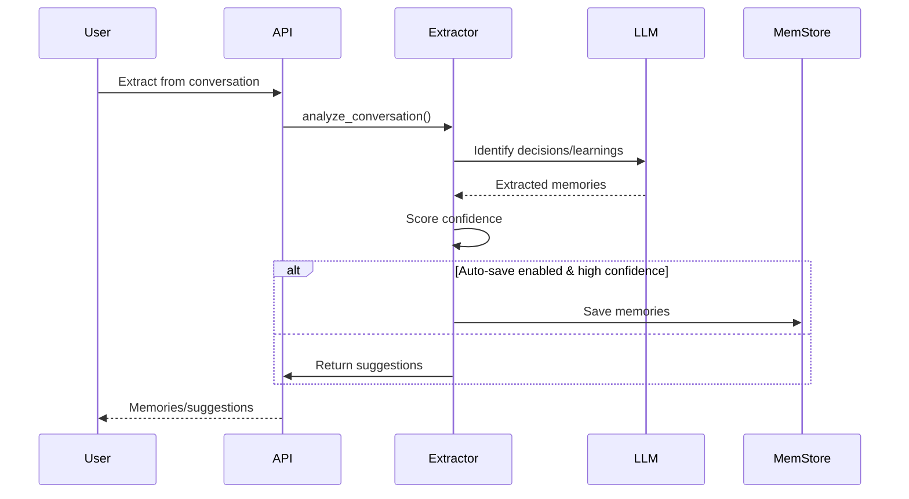

**LLM Prompt for Extraction**:
```python
prompt = f"""Analyze this conversation and extract important project knowledge.

Conversation:
{format_conversation(conversation)}

Extract:
1. Technical decisions and rationale
2. Preferences and conventions
3. Problems encountered and solutions
4. Important insights or learnings

For each item, provide:
- Type (decision/preference/experience/note)
- Title (short summary)
- Content (detailed description)
- Confidence score (0-1)

Return as JSON list.
"""
```

**Example Extraction Result**:
```python
[
    {
        "type": "decision",
        "title": "Use Redis for caching",
        "content": "Decided to add Redis caching layer for API responses",
        "reason": "Reduce database load and improve response times",
        "confidence": 0.85,
        "importance": 0.8,
        "tags": ["caching", "performance", "redis"]
    }
]
```

**Auto-save Logic**:
```python
if auto_save:
    for memory in extracted_memories:
        if memory['confidence'] > 0.7:  # High confidence threshold
            await memory_store.add_memory(**memory)
```

### Memory Search Flow

**API Endpoint**: `POST /api/v1/memory/search`

```python
{
    "project_id": "myapp",
    "query": "database decisions",
    "memory_type": "decision",
    "tags": ["database"],
    "min_importance": 0.7,
    "limit": 10
}
```

**Search Strategy**:

```cypher
// Fulltext search with filters
CALL db.index.fulltext.queryNodes('memory_search', $query)
YIELD node as m, score

WHERE m.project_id = $project_id
  AND m.is_active = true
  AND ($memory_type IS NULL OR m.memory_type = $memory_type)
  AND m.importance >= $min_importance
  AND ($tags IS NULL OR ANY(tag IN $tags WHERE tag IN m.tags))

RETURN m, score
ORDER BY score DESC, m.importance DESC
LIMIT $limit
```

**Result Ranking**:
```python
def rank_memories(results: List[dict]) -> List[dict]:
    """Rank by search score and importance"""
    for result in results:
        result['rank_score'] = (
            result['search_score'] * 0.6 +
            result['importance'] * 0.4
        )
    return sorted(results, key=lambda x: x['rank_score'], reverse=True)
```

### Memory Evolution (Supersede)

**Supersede Flow**:

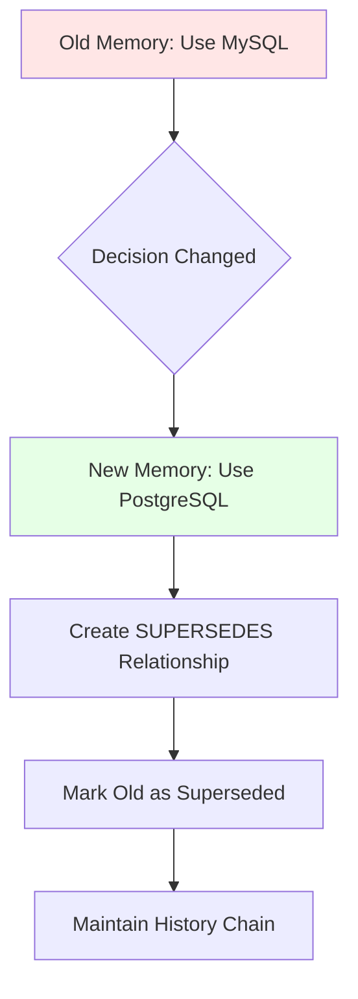

**Implementation**:
```cypher
// 1. Create new memory
CREATE (new:Memory {
    id: $new_id,
    title: $new_title,
    content: $new_content,
    ...
})

// 2. Link to old memory
MATCH (old:Memory {id: $old_id})
CREATE (new)-[:SUPERSEDES]->(old)

// 3. Update old memory
SET old.superseded_by = $new_id,
    old.is_active = false

RETURN new, old
```

**History Traversal**:
```cypher
// Get full evolution history
MATCH path = (latest:Memory)-[:SUPERSEDES*]->(oldest:Memory)
WHERE latest.id = $memory_id
RETURN nodes(path) as history
```

## Code Graph Ingestion Pipeline

### Overview

Converting code repositories into queryable graph structure:

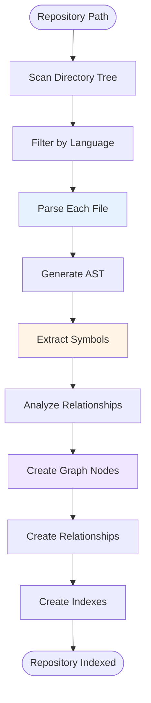

### Step-by-Step Flow

#### 1. Repository Scanning

**API Endpoint**: `POST /api/v1/code/ingest`

```python
{
    "repo_path": "/path/to/repository",
    "repo_name": "myapp",
    "file_patterns": ["*.py", "*.js"]  # Optional filters
}
```

**Directory Walk**:
```python
def scan_repository(repo_path: str) -> List[str]:
    """Scan directory and collect files"""
    files = []

    for root, dirs, filenames in os.walk(repo_path):
        # Skip common ignored directories
        dirs[:] = [d for d in dirs if d not in {
            '.git', 'node_modules', '__pycache__', '.venv'
        }]

        for filename in filenames:
            file_path = os.path.join(root, filename)
            if should_process_file(file_path):
                files.append(file_path)

    return files
```

**Language Detection**:
```python
LANGUAGE_EXTENSIONS = {
    '.py': 'python',
    '.js': 'javascript',
    '.ts': 'typescript',
    '.java': 'java',
    '.go': 'go',
    '.cpp': 'cpp',
    '.sql': 'sql'
}

language = LANGUAGE_EXTENSIONS.get(file_extension)
```

#### 2. File Parsing

**Python Parsing Example**:

```python
import ast

def parse_python_file(file_path: str) -> ParseResult:
    """Parse Python file using AST"""
    with open(file_path, 'r') as f:
        source = f.read()

    tree = ast.parse(source, filename=file_path)

    symbols = []
    relationships = []

    for node in ast.walk(tree):
        if isinstance(node, ast.FunctionDef):
            # Extract function
            symbols.append({
                'type': 'function',
                'name': node.name,
                'line': node.lineno,
                'params': [arg.arg for arg in node.args.args],
                'decorators': [d.id for d in node.decorator_list if isinstance(d, ast.Name)]
            })

            # Extract function calls
            for child in ast.walk(node):
                if isinstance(child, ast.Call):
                    if isinstance(child.func, ast.Name):
                        relationships.append({
                            'from': node.name,
                            'to': child.func.id,
                            'type': 'CALLS'
                        })

        elif isinstance(node, ast.ClassDef):
            # Extract class
            symbols.append({
                'type': 'class',
                'name': node.name,
                'line': node.lineno,
                'bases': [base.id for base in node.bases if isinstance(base, ast.Name)],
                'methods': [m.name for m in node.body if isinstance(m, ast.FunctionDef)]
            })

            # Extract inheritance
            for base in node.bases:
                if isinstance(base, ast.Name):
                    relationships.append({
                        'from': node.name,
                        'to': base.id,
                        'type': 'INHERITS'
                    })

    return ParseResult(symbols=symbols, relationships=relationships)
```

**JavaScript Parsing Example**:

```python
# Using esprima or similar parser
import esprima

def parse_javascript_file(file_path: str) -> ParseResult:
    """Parse JavaScript file"""
    with open(file_path, 'r') as f:
        source = f.read()

    tree = esprima.parseScript(source, {'loc': True})

    # Extract functions, classes, imports
    # Similar to Python parsing
```

#### 3. Graph Construction

**Create Repository Node**:
```cypher
CREATE (r:Repo {
    id: $repo_id,
    name: $repo_name,
    path: $repo_path,
    created_at: datetime(),
    file_count: $file_count
})
```

**Create File Nodes**:
```cypher
CREATE (f:File {
    repoId: $repo_id,
    path: $file_path,
    lang: $language,
    content: $source_code,
    lines: $line_count,
    last_modified: datetime()
})
CREATE (f)-[:BELONGS_TO]->(r:Repo {id: $repo_id})
```

**Create Symbol Nodes**:
```cypher
// Function
CREATE (s:Symbol:Function {
    id: $symbol_id,
    name: $function_name,
    type: 'function',
    line: $line_number,
    params: $parameters,
    file_path: $file_path
})
CREATE (s)-[:DEFINED_IN]->(f:File {path: $file_path})

// Class
CREATE (s:Symbol:Class {
    id: $symbol_id,
    name: $class_name,
    type: 'class',
    line: $line_number,
    methods: $method_list,
    file_path: $file_path
})
CREATE (s)-[:DEFINED_IN]->(f:File {path: $file_path})
```

**Create Relationships**:
```cypher
// Function calls
MATCH (caller:Function {name: $caller_name})
MATCH (callee:Function {name: $callee_name})
CREATE (caller)-[:CALLS]->(callee)

// Class inheritance
MATCH (child:Class {name: $child_name})
MATCH (parent:Class {name: $parent_name})
CREATE (child)-[:INHERITS]->(parent)

// Module imports
MATCH (file:File {path: $importer_path})
MATCH (imported:File {path: $imported_path})
CREATE (file)-[:IMPORTS]->(imported)
```

#### 4. Progress Tracking

**Task Progress Updates**:
```python
async def ingest_repository_with_progress(repo_path: str, task_id: str):
    """Ingest with progress updates"""
    files = scan_repository(repo_path)
    total_files = len(files)

    for i, file_path in enumerate(files):
        # Parse file
        result = parse_file(file_path)

        # Store in graph
        await store_file_in_graph(result)

        # Update progress
        progress = (i + 1) / total_files
        await task_queue.update_progress(
            task_id,
            progress,
            f"Processed {i+1}/{total_files} files"
        )
```

#### 5. Code Graph Queries

**Find Related Code**:
```cypher
// Find all functions that call a specific function
MATCH (caller:Function)-[:CALLS]->(target:Function {name: $function_name})
RETURN caller.name, caller.file_path

// Find class hierarchy
MATCH path = (child:Class)-[:INHERITS*]->(parent:Class {name: $class_name})
RETURN nodes(path)

// Find all files that import a module
MATCH (file:File)-[:IMPORTS]->(module:File {path: $module_path})
RETURN file.path
```

**Impact Analysis**:
```cypher
// Find all code affected by changing a function
MATCH (target:Function {name: $function_name})
MATCH path = (dependent:Function)-[:CALLS*1..3]->(target)
RETURN DISTINCT dependent.name, dependent.file_path, length(path) as depth
ORDER BY depth
```

## Task Processing Pipeline

### Overview

Asynchronous task lifecycle:

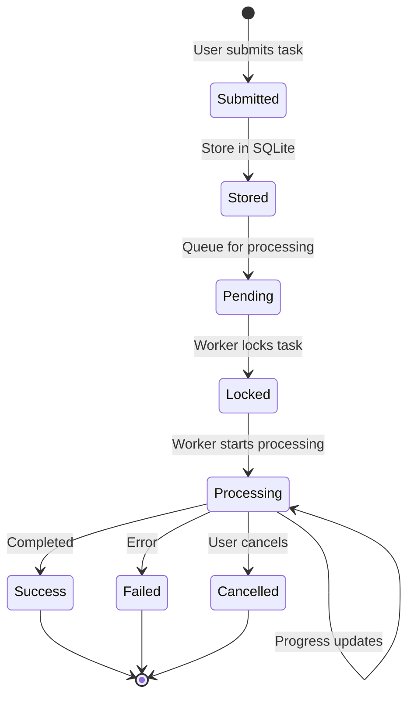

### Task Submission Flow

**Submit Document Task**:

```python
async def submit_document_processing_task(
    content: str,
    title: str,
    metadata: dict
) -> str:
    """Submit document processing as background task"""
    # 1. Create task data
    task_data = {
        'type': 'document_processing',
        'content': content,
        'title': title,
        'metadata': metadata
    }

    # 2. Submit to queue
    task_id = await task_queue.submit_task(
        task_func=process_document_task,
        task_type='document_processing',
        task_data=task_data
    )

    return task_id
```

**Task Storage**:

```python
# Store in SQLite
await task_storage.store_task(
    task_id=task_id,
    status=TaskStatus.PENDING,
    task_type='document_processing',
    metadata=task_data
)
```

### Worker Processing Flow

**Worker Loop**:

```python
async def _process_pending_tasks(self):
    """Background worker continuously processes tasks"""
    while True:
        try:
            # 1. Get pending tasks (with lock)
            pending = await self._storage.get_pending_tasks(limit=10)

            # 2. Process each task (respecting concurrency limit)
            for task in pending:
                if len(self.running_tasks) < self.max_concurrent_tasks:
                    # Start task processing
                    asyncio.create_task(self._execute_task(task))

            # 3. Wait before next poll
            await asyncio.sleep(1)

        except asyncio.CancelledError:
            logger.info("Worker shutting down")
            break
        except Exception as e:
            logger.error(f"Worker error: {e}")
            await asyncio.sleep(5)  # Back off on error
```

**Task Execution**:

```python
async def _execute_task(self, task: TaskResult):
    """Execute single task"""
    async with self.task_semaphore:  # Limit concurrency
        try:
            # 1. Update status
            task.status = TaskStatus.PROCESSING
            task.started_at = datetime.now()
            await self._storage.update_task_status(task.task_id, task.status)

            # 2. Get appropriate processor
            processor = processor_registry.get_processor(task.metadata['type'])

            # 3. Execute with progress updates
            result = await processor.process(task)

            # 4. Mark success
            task.status = TaskStatus.SUCCESS
            task.result = result
            task.completed_at = datetime.now()
            task.progress = 1.0

        except Exception as e:
            # Mark failed
            task.status = TaskStatus.FAILED
            task.error = str(e)
            task.completed_at = datetime.now()
            logger.error(f"Task {task.task_id} failed: {e}")

        finally:
            # Save final state
            await self._storage.update_task(task)
            self.running_tasks.pop(task.task_id, None)
```

### Real-time Monitoring

**SSE Stream**:

```python
@app.get("/api/v1/sse/task/{task_id}")
async def stream_task_progress(task_id: str):
    """Stream task progress via Server-Sent Events"""
    async def event_generator():
        while True:
            # Get current task status
            task = task_queue.get_task(task_id)

            if task:
                # Send update
                yield {
                    "event": "progress",
                    "data": json.dumps({
                        "task_id": task.task_id,
                        "status": task.status.value,
                        "progress": task.progress,
                        "message": task.message
                    })
                }

                # Stop if terminal state
                if task.status in {TaskStatus.SUCCESS, TaskStatus.FAILED, TaskStatus.CANCELLED}:
                    break

            await asyncio.sleep(0.5)  # Poll interval

    return EventSourceResponse(event_generator())
```

**WebSocket Updates**:

```python
@app.websocket("/api/v1/ws/task/{task_id}")
async def task_websocket(websocket: WebSocket, task_id: str):
    """WebSocket for real-time task updates"""
    await websocket.accept()

    try:
        while True:
            task = task_queue.get_task(task_id)

            if task:
                # Send update
                await websocket.send_json({
                    "task_id": task.task_id,
                    "status": task.status.value,
                    "progress": task.progress,
                    "message": task.message
                })

                # Stop if done
                if task.status in {TaskStatus.SUCCESS, TaskStatus.FAILED}:
                    break

            await asyncio.sleep(0.5)

    except WebSocketDisconnect:
        logger.info(f"Client disconnected from task {task_id}")
```

## Real-time Update Pipeline

### Architecture

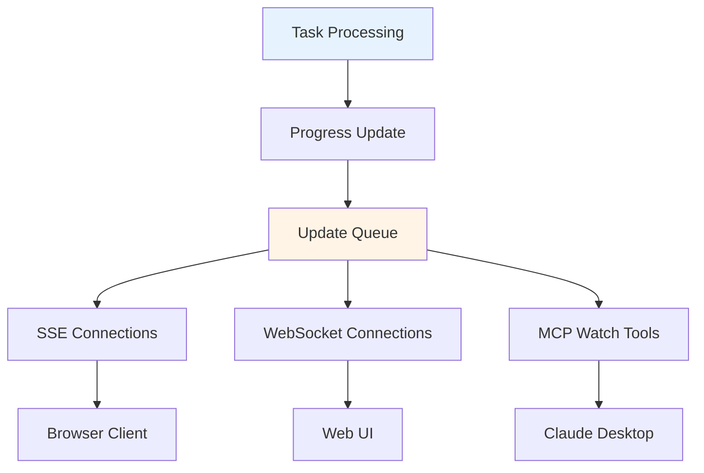

### Update Flow

**1. Task Progress Update**:

```python
# Inside task processor
await task_queue.update_progress(
    task_id=task_id,
    progress=0.5,
    message="Processed 50% of documents"
)
```

**2. Broadcast to Listeners**:

```python
class TaskQueue:
    async def update_progress(self, task_id: str, progress: float, message: str):
        """Update progress and notify listeners"""
        # Update task
        task = self.tasks[task_id]
        task.progress = progress
        task.message = message

        # Store in database
        await self._storage.update_task(task)

        # Notify SSE listeners
        await self._notify_sse_listeners(task_id, task)

        # Notify WebSocket listeners
        await self._notify_ws_listeners(task_id, task)
```

**3. SSE Delivery**:

```python
async def _notify_sse_listeners(self, task_id: str, task: TaskResult):
    """Send update to SSE clients"""
    if task_id in self.sse_listeners:
        event_data = {
            "task_id": task_id,
            "status": task.status.value,
            "progress": task.progress,
            "message": task.message
        }

        for queue in self.sse_listeners[task_id]:
            await queue.put(event_data)
```

## MCP Request Pipeline

### Overview

Model Context Protocol request handling:

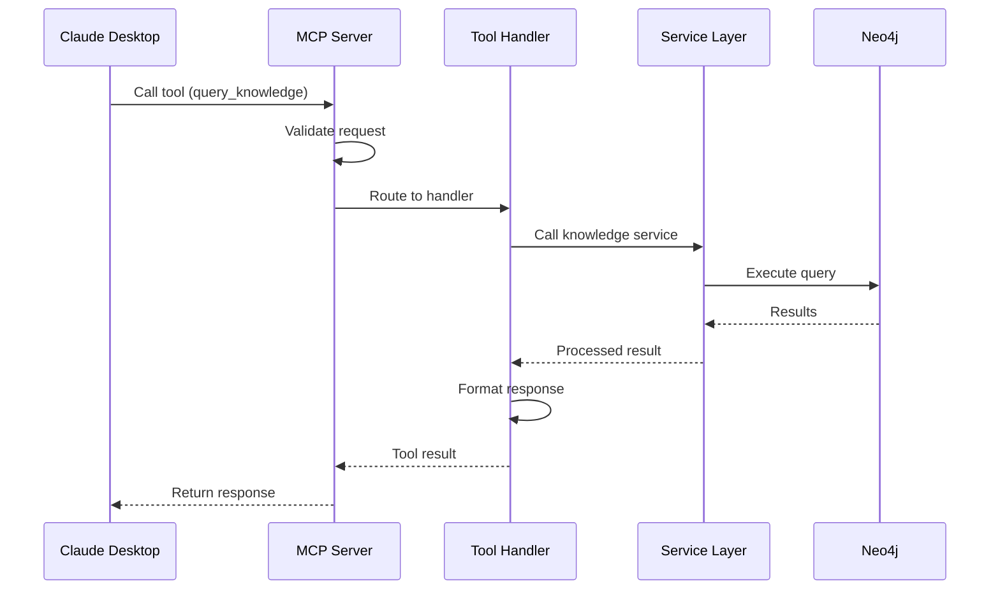

### Request Flow

**1. Tool Invocation**:

```python
# Client (Claude Desktop) calls tool
{
    "method": "tools/call",
    "params": {
        "name": "query_knowledge",
        "arguments": {
            "question": "How does authentication work?",
            "top_k": 5
        }
    }
}
```

**2. Server Routing**:

```python
@app.call_tool()
async def call_tool(name: str, arguments: dict) -> Sequence[TextContent]:
    """Route tool call to appropriate handler"""
    # Get handler for tool
    handler = TOOL_HANDLERS.get(name)

    if not handler:
        raise ValueError(f"Unknown tool: {name}")

    # Execute handler
    result = await handler(arguments)

    # Format response
    return [TextContent(
        type="text",
        text=format_result(result)
    )]
```

**3. Handler Execution**:

```python
async def handle_query_knowledge(arguments: dict) -> dict:
    """Handle knowledge query"""
    # Validate arguments
    question = arguments.get("question")
    if not question:
        return {"success": False, "error": "Question required"}

    top_k = arguments.get("top_k", 5)

    # Call service
    result = await neo4j_knowledge_service.query(
        question=question,
        top_k=top_k
    )

    return result
```

**4. Response Formatting**:

```python
def format_result(result: dict) -> str:
    """Format result for MCP client"""
    if not result.get("success"):
        return f"Error: {result.get('error', 'Unknown error')}"

    # Format answer with sources
    answer = result.get("answer", "")
    sources = result.get("sources", [])

    formatted = f"Answer:\n{answer}\n\n"

    if sources:
        formatted += "Sources:\n"
        for i, source in enumerate(sources, 1):
            formatted += f"{i}. {source.get('title')} (relevance: {source.get('relevance', 0):.2f})\n"

    return formatted
```

## Data Flow Patterns

### Pattern 1: Synchronous Request-Response

**Use Case**: Quick operations (< 1 second)

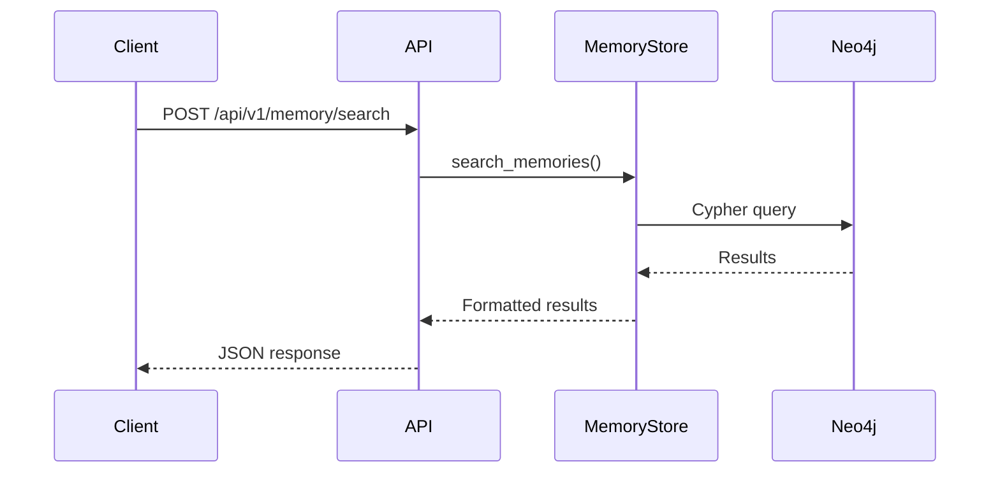

**Example**: Memory search, graph queries, statistics

### Pattern 2: Asynchronous Task Processing

**Use Case**: Long operations (> 1 second)

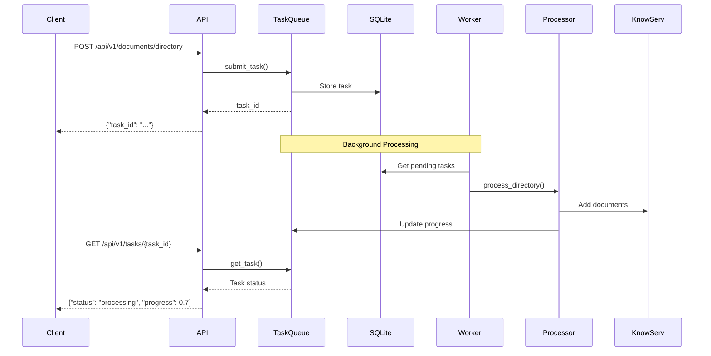

**Example**: Directory processing, large document ingestion, repository ingestion

### Pattern 3: Streaming Updates

**Use Case**: Real-time progress monitoring

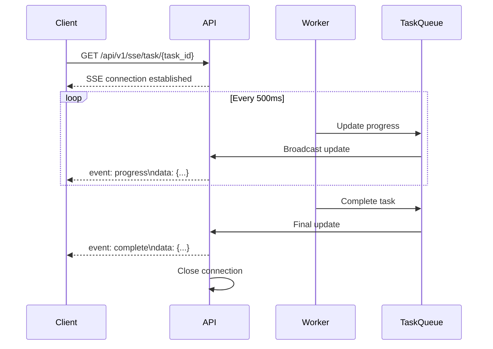

**Example**: Task monitoring, batch operations, long-running queries

### Pattern 4: Batch Processing

**Use Case**: Multiple operations with coordination

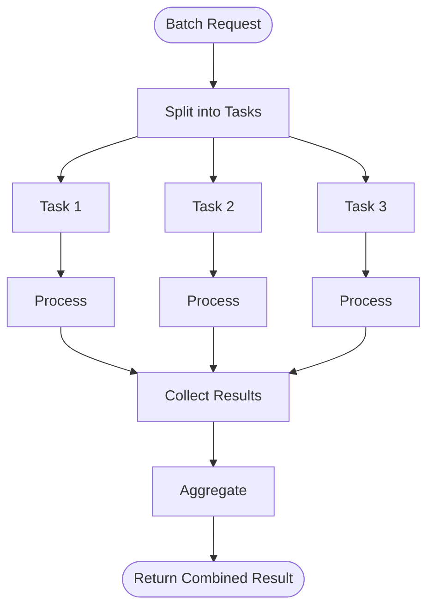

**Implementation**:
```python
async def batch_process_files(file_paths: List[str]) -> dict:
    """Process multiple files in parallel"""
    # Create tasks
    tasks = [
        asyncio.create_task(process_file(path))
        for path in file_paths
    ]

    # Wait for all tasks
    results = await asyncio.gather(*tasks, return_exceptions=True)

    # Aggregate results
    successful = [r for r in results if not isinstance(r, Exception)]
    failed = [r for r in results if isinstance(r, Exception)]

    return {
        "total": len(file_paths),
        "successful": len(successful),
        "failed": len(failed),
        "results": successful
    }
```

## Performance Considerations

### Database Query Optimization

**Use Indexes**:
```cypher
// Always use indexed properties in WHERE clauses
MATCH (m:Memory)
WHERE m.id = $id  // Uses unique constraint index
RETURN m

// vs.

MATCH (m:Memory)
WHERE m.content CONTAINS $text  // Full scan - slow!
RETURN m
```

**Limit Result Sets**:
```cypher
// Always use LIMIT
MATCH (d:Document)
RETURN d
LIMIT 100  // Prevent returning entire database
```

**Use Query Hints**:
```cypher
// Force index usage
MATCH (m:Memory)
USING INDEX m:Memory(id)
WHERE m.id = $id
RETURN m
```

### Embedding Optimization

**Batch Embeddings**:
```python
# Instead of one at a time
for text in texts:
    embedding = await embed_model.get_text_embedding(text)

# Batch process
embeddings = await embed_model.get_text_embeddings(texts)
```

**Cache Embeddings**:
```python
# Cache by content hash
content_hash = hashlib.sha256(text.encode()).hexdigest()
if content_hash in embedding_cache:
    return embedding_cache[content_hash]
```

### Task Queue Optimization

**Concurrency Tuning**:
```python
# Adjust based on resources
task_queue = TaskQueue(max_concurrent_tasks=5)  # CPU-bound
task_queue = TaskQueue(max_concurrent_tasks=20)  # I/O-bound
```

**Task Prioritization**:
```python
# High priority tasks first
async def get_pending_tasks(self, priority_order: bool = True):
    if priority_order:
        query = "ORDER BY priority DESC, created_at ASC"
    else:
        query = "ORDER BY created_at ASC"
```

## Error Handling Patterns

### Retry Pattern

```python
async def retry_on_error(func, max_retries=3, backoff=2):
    """Retry with exponential backoff"""
    for attempt in range(max_retries):
        try:
            return await func()
        except TransientError as e:
            if attempt == max_retries - 1:
                raise
            wait_time = backoff ** attempt
            await asyncio.sleep(wait_time)
```

### Circuit Breaker

```python
class CircuitBreaker:
    """Prevent cascading failures"""
    def __init__(self, failure_threshold=5, timeout=60):
        self.failure_count = 0
        self.failure_threshold = failure_threshold
        self.timeout = timeout
        self.last_failure_time = None
        self.state = "CLOSED"  # CLOSED, OPEN, HALF_OPEN

    async def call(self, func):
        if self.state == "OPEN":
            if time.time() - self.last_failure_time > self.timeout:
                self.state = "HALF_OPEN"
            else:
                raise CircuitBreakerOpen()

        try:
            result = await func()
            if self.state == "HALF_OPEN":
                self.state = "CLOSED"
                self.failure_count = 0
            return result
        except Exception as e:
            self.failure_count += 1
            self.last_failure_time = time.time()

            if self.failure_count >= self.failure_threshold:
                self.state = "OPEN"
            raise
```

## Conclusion

The data flow architecture is designed for:

1. **Efficiency**: Minimize processing time and resource usage
2. **Reliability**: Handle errors gracefully with retries and fallbacks
3. **Scalability**: Support both sync and async patterns
4. **Observability**: Track all data transformations and state changes
5. **Flexibility**: Support multiple ingestion and query patterns

Understanding these flows enables:
- Effective debugging
- Performance optimization
- System extension
- Operational monitoring
