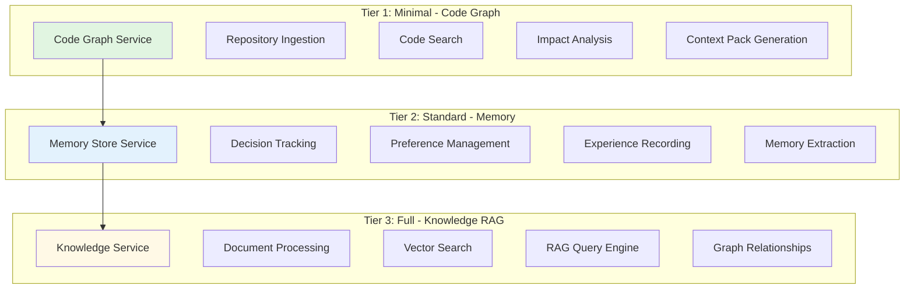
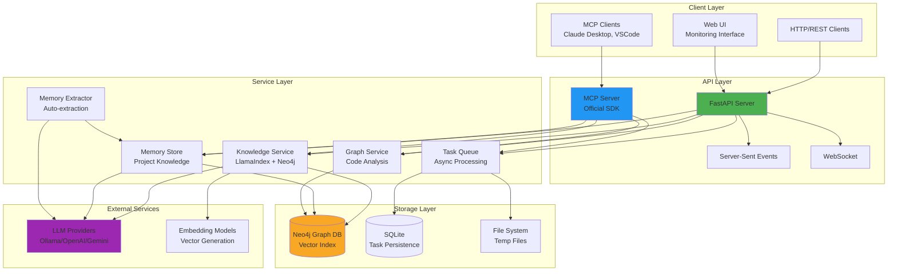
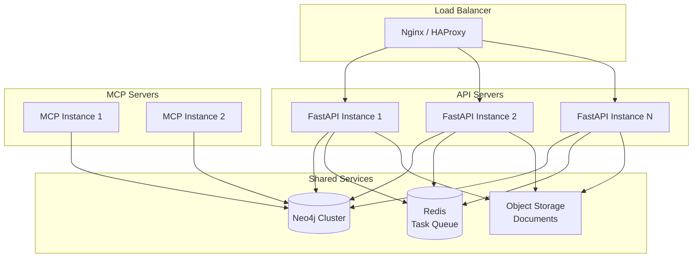

# System Design and Architecture

## Table of Contents

- [Overview](#overview)
- [Architecture Tiers](#architecture-tiers)
- [Design Philosophy](#design-philosophy)
- [System Architecture](#system-architecture)
- [Technology Stack](#technology-stack)
- [Design Decisions](#design-decisions)
- [Scalability Considerations](#scalability-considerations)
- [Security Architecture](#security-architecture)

## Overview

Code Graph Knowledge System is a Neo4j-based intelligent knowledge management system that combines:

- **Vector Search**: Semantic similarity search using embeddings
- **Graph Database**: Relationship-based knowledge representation
- **LLM Integration**: Multiple provider support for AI-powered features
- **RAG (Retrieval Augmented Generation)**: Context-aware question answering
- **Code Graph Analysis**: Repository structure and dependency analysis
- **Memory Management**: Persistent project knowledge for AI agents

The system is designed as a **multi-tier architecture** where each tier builds upon the previous one, allowing users to adopt capabilities incrementally based on their needs.

## Architecture Tiers

The system implements a three-tier architecture, each providing distinct capabilities:



### Tier 1: Minimal (Code Graph)

**Purpose**: Static code analysis and repository understanding

**Components**:
- Code ingestor with multi-language support
- Graph-based code structure representation
- Symbol relationship tracking
- Impact analysis engine

**Use Cases**:
- Understanding codebase structure
- Finding related code components
- Analyzing change impact
- Generating context for AI tools

**Resource Requirements**: Low (minimal LLM usage)

### Tier 2: Standard (+ Memory)

**Purpose**: Project knowledge persistence for AI agents

**Components**:
- Memory Store service with typed memories
- Search and retrieval system
- Automatic extraction from commits/comments
- Memory evolution tracking (supersede mechanism)

**Use Cases**:
- Recording architectural decisions
- Tracking team preferences
- Learning from past problems
- Maintaining consistency across sessions

**Resource Requirements**: Medium (LLM for extraction features)

### Tier 3: Full (+ Knowledge RAG)

**Purpose**: Intelligent document processing and question answering

**Components**:
- LlamaIndex-based knowledge graph
- Vector embedding generation
- Multi-source document ingestion
- RAG query engine with graph traversal

**Use Cases**:
- Natural language querying
- Document-based question answering
- Cross-document knowledge synthesis
- Semantic search across knowledge base

**Resource Requirements**: High (intensive LLM and embedding usage)

## Design Philosophy

### 1. Progressive Complexity

The tier-based architecture allows users to:
- Start with minimal features (Code Graph only)
- Add memory capabilities when needed
- Enable full RAG when ready for advanced features

**Trade-off**: Increased system complexity vs. flexibility

### 2. Multi-Provider Support

Support for multiple LLM and embedding providers:
- **Ollama**: Local deployment, privacy-focused
- **OpenAI**: High quality, cloud-based
- **Google Gemini**: Competitive performance
- **OpenRouter**: Access to multiple models
- **HuggingFace**: Open-source embeddings

**Trade-off**: More configuration complexity vs. vendor flexibility

### 3. Async-First Design

All I/O operations are asynchronous:
- Non-blocking request handling
- Background task processing
- Concurrent operation support

**Trade-off**: Programming complexity vs. performance

### 4. Service-Oriented Architecture

Clear separation of concerns:
- Each service has a single responsibility
- Services communicate through well-defined interfaces
- Easy to test and maintain

**Trade-off**: More files/modules vs. maintainability

## System Architecture

### High-Level Architecture



### Component Layers

#### 1. Client Layer

**HTTP/REST Clients**:
- Standard HTTP requests
- JSON-based communication
- OpenAPI/Swagger documentation

**MCP Clients**:
- Claude Desktop integration
- VSCode with MCP extension
- Custom MCP client implementations
- Uses official MCP SDK protocol

**Web UI**:
- Real-time monitoring interface (NiceGUI)
- Task status visualization
- File upload and processing
- WebSocket-based updates

#### 2. API Layer

**FastAPI Server** (`main.py`, `core/app.py`):
- RESTful API endpoints
- Async request handling
- CORS middleware
- GZip compression
- Exception handling

**MCP Server** (`mcp_server.py`, `start_mcp.py`):
- 30 tools across 6 categories
- Official MCP SDK implementation
- Session management
- Streaming support
- Multi-transport (stdio, SSE, WebSocket)

**Real-time Communication**:
- Server-Sent Events for task monitoring
- WebSocket for UI updates
- Streaming responses for long operations

#### 3. Service Layer

**Knowledge Service** (`services/neo4j_knowledge_service.py`):
- LlamaIndex KnowledgeGraphIndex integration
- Vector embedding generation
- Document processing and chunking
- RAG query engine

**Memory Store** (`services/memory_store.py`):
- Project knowledge persistence
- Typed memory system (decision/preference/experience/convention/plan/note)
- Search with filters and importance scoring
- Memory evolution (supersede mechanism)

**Graph Service** (`services/graph_service.py`):
- Code graph management
- Cypher query execution
- Schema management
- Relationship traversal

**Task Queue** (`services/task_queue.py`):
- Async background processing
- SQLite-based persistence
- Concurrent task limiting
- Status tracking and updates

**Memory Extractor** (`services/memory_extractor.py`):
- Conversation analysis
- Git commit mining
- Code comment extraction
- Batch repository analysis

#### 4. Storage Layer

**Neo4j Graph Database**:
- Knowledge graph storage
- Native vector indexing
- Relationship management
- Fulltext search indexes

**SQLite Database**:
- Task queue persistence
- Task status tracking
- Worker coordination

**File System**:
- Temporary file storage
- Large document handling
- Upload processing

## Technology Stack

### Core Framework

```yaml
Web Framework:
  - FastAPI: Async web framework
  - Uvicorn: ASGI server
  - Pydantic: Data validation

MCP Integration:
  - mcp>=1.1.0: Official Model Context Protocol SDK
  - Custom handlers: Modular tool organization
```

### Database & Storage

```yaml
Graph Database:
  - Neo4j 5.0+: Graph and vector storage
  - APOC plugin: Advanced procedures
  - Native vector index: Semantic search

Task Persistence:
  - SQLite: Lightweight task storage
  - Async driver: Non-blocking operations
```

### AI & ML

```yaml
LLM Integration:
  - LlamaIndex: RAG framework
  - Ollama: Local LLM hosting
  - OpenAI: GPT models
  - Google Gemini: Gemini models
  - OpenRouter: Multi-provider access

Embedding Models:
  - Ollama: nomic-embed-text
  - OpenAI: text-embedding-ada-002
  - Gemini: models/embedding-001
  - HuggingFace: BAAI/bge-small-en-v1.5
```

### Developer Tools

```yaml
Code Quality:
  - Black: Code formatting
  - isort: Import sorting
  - Ruff: Fast linting
  - pytest: Testing framework

Monitoring:
  - Loguru: Structured logging
  - NiceGUI: Web monitoring UI
  - SSE: Real-time updates
```

## Design Decisions

### 1. Neo4j as Primary Database

**Decision**: Use Neo4j for all persistent storage (knowledge, memory, code graph)

**Rationale**:
- Native graph queries for relationships
- Built-in vector indexing (v5.0+)
- Fulltext search capabilities
- ACID compliance
- Scales well for graph traversal

**Trade-offs**:
- More complex than traditional SQL
- Requires Neo4j infrastructure
- Learning curve for Cypher queries
- Higher memory usage

**Alternatives Considered**:
- PostgreSQL + pgvector: Good but weaker graph queries
- Separate vector DB (Pinecone/Weaviate): Additional infrastructure
- MongoDB: Poor relationship handling

### 2. LlamaIndex for RAG

**Decision**: Use LlamaIndex's KnowledgeGraphIndex

**Rationale**:
- Production-ready RAG framework
- Neo4j integration out-of-the-box
- Flexible node parser system
- Active development and community

**Trade-offs**:
- Additional abstraction layer
- Some LlamaIndex-specific patterns
- Updates may require code changes

**Alternatives Considered**:
- LangChain: More complex, heavier
- Custom RAG: More control but more work
- Haystack: Less graph-oriented

### 3. Async Task Queue

**Decision**: Custom async task queue with SQLite persistence

**Rationale**:
- Simple deployment (no external queue)
- Sufficient for single-server deployment
- Task persistence across restarts
- Direct integration with FastAPI

**Trade-offs**:
- Not distributed (single server only)
- Limited throughput vs. Redis/RabbitMQ
- SQLite lock contention possible

**Alternatives Considered**:
- Celery + Redis: Overkill for single server
- RQ: Still requires Redis
- Dramatiq: More dependencies

### 4. Multi-Provider LLM Support

**Decision**: Support multiple LLM and embedding providers

**Rationale**:
- Vendor independence
- Local deployment option (Ollama)
- Cost optimization
- Feature comparison capability

**Trade-offs**:
- More configuration complexity
- Testing burden across providers
- Inconsistent behavior possible

**Alternatives Considered**:
- Single provider (OpenAI): Simple but vendor lock-in
- LiteLLM proxy: Additional component

### 5. MCP Server with Official SDK

**Decision**: Migrate from FastMCP to official MCP SDK

**Rationale**:
- Official protocol compliance
- Better long-term support
- Advanced features (streaming, sessions)
- Industry standard

**Trade-offs**:
- More verbose code
- Lower-level API
- Migration effort required

**Alternatives Considered**:
- Keep FastMCP: Simpler but less standard
- Direct HTTP API only: Miss Claude Desktop integration

### 6. Tier-Based Architecture

**Decision**: Three-tier progressive architecture

**Rationale**:
- Gradual adoption curve
- Cost optimization (use only what's needed)
- Clear feature boundaries
- Independent scaling

**Trade-offs**:
- More complex initialization
- Feature interdependencies
- Documentation overhead

**Alternatives Considered**:
- All-or-nothing: Simpler but less flexible
- Plugin system: More complex

## Scalability Considerations

### Current Architecture (Single Server)

**Designed for**:
- Small to medium teams (1-50 users)
- Moderate query volume (<1000 req/hour)
- Single deployment instance
- Shared Neo4j database

**Bottlenecks**:
1. Neo4j connection pool
2. Task queue concurrency limit
3. LLM API rate limits
4. Memory constraints for large documents

### Horizontal Scaling Path



**Required Changes**:
1. Replace SQLite task queue with Redis/RabbitMQ
2. Use object storage (S3/MinIO) for file uploads
3. Session management with Redis
4. Neo4j clustering for HA
5. Shared cache layer

### Vertical Scaling

**Immediate Improvements**:
- Increase Neo4j memory (`dbms.memory.heap.max_size`)
- Tune vector index parameters
- Optimize chunk sizes
- Add Redis caching layer
- Use faster embedding models

### Performance Optimization

**Database Level**:
```cypher
// Ensure proper indexes exist
CREATE INDEX IF NOT EXISTS FOR (n:Document) ON (n.id);
CREATE INDEX IF NOT EXISTS FOR (m:Memory) ON (m.project_id, m.importance);
CREATE FULLTEXT INDEX IF NOT EXISTS FOR (m:Memory) ON EACH [m.title, m.content];

// Vector index configuration
CALL db.index.vector.createNodeIndex(
  'knowledge_vectors',
  'Document',
  'embedding',
  1536,  // Dimension
  'cosine'
);
```

**Application Level**:
- Connection pooling
- Query result caching
- Batch operations
- Async I/O everywhere
- Background task offloading

## Security Architecture

### Authentication & Authorization

**Current Implementation**:
- Optional API key authentication
- Environment-based configuration
- No user management (designed for internal use)

**Production Recommendations**:
```yaml
Authentication:
  - API key per user/service
  - JWT tokens for session management
  - OAuth2 for third-party integration

Authorization:
  - Role-based access control (RBAC)
  - Project-level permissions
  - Rate limiting per API key
```

### Data Security

**At Rest**:
- Neo4j encryption (`dbms.security.encryption.enabled=true`)
- Environment variable encryption
- Secrets management (AWS Secrets Manager, Vault)

**In Transit**:
- TLS/HTTPS for all HTTP traffic
- Neo4j Bolt encryption
- Secure WebSocket (WSS)

**Code Security**:
```python
# Input validation with Pydantic
class DocumentAddRequest(BaseModel):
    content: str = Field(..., max_length=10_000_000)
    title: str = Field(..., max_length=200)

# SQL injection prevention (parameterized queries)
await session.run(
    "CREATE (d:Document {id: $id, title: $title})",
    id=doc_id, title=title
)

# XSS prevention (automatic escaping in FastAPI)
# CSRF protection for web UI
```

### Network Security

**Recommended Deployment**:
```yaml
VPC Configuration:
  - Private subnet for Neo4j
  - Public subnet for API (behind ALB)
  - Security groups for port control

Firewall Rules:
  - 8123: API access (restricted IPs)
  - 7687: Neo4j Bolt (internal only)
  - 7474: Neo4j Browser (VPN only)

TLS Configuration:
  - Minimum TLS 1.2
  - Strong cipher suites
  - Certificate pinning for MCP
```

### Secrets Management

**Environment Variables**:
```bash
# Required secrets
NEO4J_PASSWORD=<strong-password>
OPENAI_API_KEY=<api-key>
GOOGLE_API_KEY=<api-key>
API_KEY=<system-api-key>

# Use secrets manager
AWS_SECRETS_MANAGER_SECRET_ID=code-graph-prod
VAULT_ADDR=https://vault.company.com
```

**Best Practices**:
- Never commit secrets to version control
- Rotate API keys regularly
- Use managed secrets services in production
- Separate secrets per environment
- Audit secret access

### Threat Model

**Potential Threats**:
1. **Unauthorized Access**: API key leakage
   - Mitigation: Strong keys, rotation, IP whitelisting

2. **Data Injection**: Malicious document content
   - Mitigation: Input validation, content sanitization

3. **Resource Exhaustion**: Large document uploads
   - Mitigation: Size limits, rate limiting, timeouts

4. **Prompt Injection**: Malicious queries to LLM
   - Mitigation: Input sanitization, output filtering

5. **Data Leakage**: Sensitive information in graph
   - Mitigation: Access controls, data classification

**Security Checklist**:
- [ ] Enable Neo4j authentication
- [ ] Use HTTPS/TLS in production
- [ ] Implement API key authentication
- [ ] Set up rate limiting
- [ ] Enable CORS restrictions
- [ ] Configure file size limits
- [ ] Set up logging and monitoring
- [ ] Regular security updates
- [ ] Backup encryption
- [ ] Secrets rotation schedule

## Monitoring & Observability

### Logging Strategy

**Structured Logging with Loguru**:
```python
logger.info("Document processed",
    doc_id=doc_id,
    size=len(content),
    duration=elapsed_time
)
```

**Log Levels**:
- DEBUG: Detailed troubleshooting
- INFO: General operational events
- WARNING: Potential issues
- ERROR: Error conditions
- CRITICAL: System failures

### Metrics Collection

**Key Metrics**:
```yaml
Application Metrics:
  - Request rate (req/sec)
  - Response time (p50, p95, p99)
  - Error rate (%)
  - Task queue depth
  - Active tasks count

Database Metrics:
  - Query execution time
  - Connection pool usage
  - Vector search latency
  - Graph traversal depth

LLM Metrics:
  - API call duration
  - Token usage
  - Error rate per provider
  - Cost tracking
```

### Health Checks

**Endpoint**: `/api/v1/health`

**Checks**:
- Neo4j connectivity
- LLM provider availability
- Task queue status
- Memory Store status

**Example Response**:
```json
{
  "status": "healthy",
  "timestamp": "2025-11-06T12:00:00Z",
  "services": {
    "neo4j": true,
    "knowledge_service": true,
    "memory_store": true,
    "task_queue": true,
    "ollama": true
  },
  "version": "1.0.0"
}
```

### Alerting

**Critical Alerts**:
- Service down (Neo4j, LLM provider)
- High error rate (>5%)
- Task queue backup (>100 pending)
- Disk space low (<10%)
- Memory usage high (>90%)

**Warning Alerts**:
- Slow queries (>5s)
- High response time (>1s p95)
- LLM API errors
- Connection pool exhaustion

## Disaster Recovery

### Backup Strategy

**Neo4j Backups**:
```bash
# Daily full backup
neo4j-admin database dump neo4j --to-path=/backups/$(date +%Y%m%d)

# Incremental backup (Enterprise)
neo4j-admin database backup --backup-dir=/backups neo4j
```

**Task Queue Backups**:
```bash
# SQLite database backup
cp tasks.db /backups/tasks_$(date +%Y%m%d_%H%M%S).db
```

**Configuration Backups**:
- `.env` file (encrypted)
- Neo4j configuration
- Application configuration

### Recovery Procedures

**Full System Recovery**:
1. Restore Neo4j from backup
2. Restore SQLite database
3. Restore configuration files
4. Verify service connectivity
5. Resume task processing

**Partial Recovery**:
- Knowledge graph: Restore from Neo4j backup
- Memory Store: Restore from Neo4j backup
- Tasks: Re-queue failed tasks

**RTO/RPO Targets**:
- RTO (Recovery Time Objective): 4 hours
- RPO (Recovery Point Objective): 24 hours (daily backups)

### High Availability

**Single Point of Failure**:
- Neo4j database (can cluster in Enterprise)
- Application server (can load balance)
- LLM provider (multi-provider fallback)

**Mitigation**:
```yaml
Neo4j Clustering:
  - 3-node cluster minimum
  - Automatic failover
  - Read replicas for scaling

Application:
  - Multiple instances behind load balancer
  - Stateless design for easy scaling
  - Health check-based routing

LLM Providers:
  - Primary + fallback provider
  - Automatic retry with exponential backoff
  - Circuit breaker pattern
```

## Future Architecture Considerations

### Potential Enhancements

**1. Distributed Task Queue**:
```python
# Replace SQLite with Redis/RabbitMQ
from celery import Celery
app = Celery('tasks', broker='redis://localhost:6379')
```

**2. Caching Layer**:
```python
# Add Redis caching
from redis import asyncio as aioredis
cache = await aioredis.from_url("redis://localhost")
```

**3. API Gateway**:
```yaml
Kong/Tyk Configuration:
  - Rate limiting
  - Authentication
  - Request transformation
  - Analytics
```

**4. Microservices Split**:
```
Current: Monolith
Future:
  - knowledge-service
  - memory-service
  - code-graph-service
  - task-worker-service
```

**5. Event-Driven Architecture**:
```python
# Event bus for service communication
from aiokafka import AIOKafkaProducer

producer = AIOKafkaProducer(bootstrap_servers='localhost:9092')
await producer.send('document.processed', value=event_data)
```

### Technology Evolution

**Short-term (3-6 months)**:
- Add Redis caching
- Implement comprehensive metrics
- Enhanced error handling
- Performance optimization

**Mid-term (6-12 months)**:
- Kubernetes deployment
- Neo4j clustering
- Distributed tracing (Jaeger)
- Advanced monitoring (Prometheus + Grafana)

**Long-term (12+ months)**:
- Microservices architecture
- Multi-region deployment
- GraphQL API option
- ML model serving infrastructure

## Conclusion

The Code Graph Knowledge System architecture is designed with these core principles:

1. **Progressive Adoption**: Three-tier architecture allows gradual capability adoption
2. **Flexibility**: Multi-provider support for LLM and embeddings
3. **Scalability**: Clear path from single-server to distributed deployment
4. **Maintainability**: Service-oriented design with clear boundaries
5. **Performance**: Async-first design for optimal throughput
6. **Security**: Built-in security considerations for production use

The architecture balances simplicity for initial deployment with clear paths for scaling and enhancement as needs grow.
