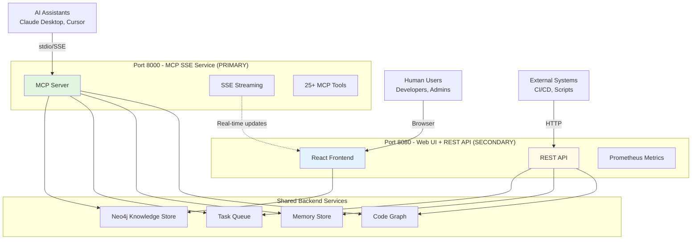
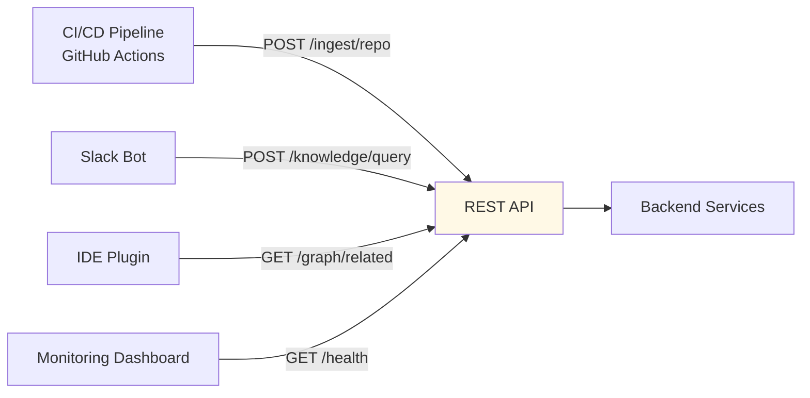
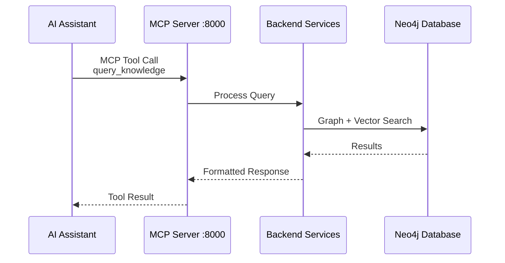
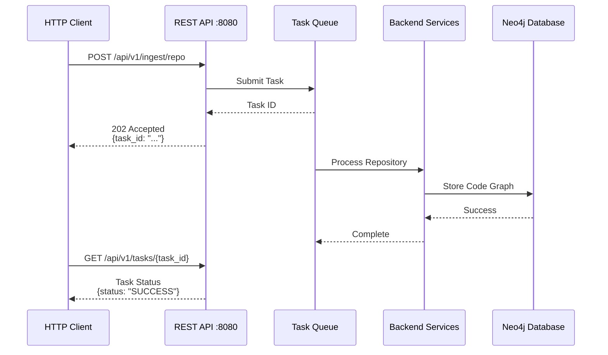
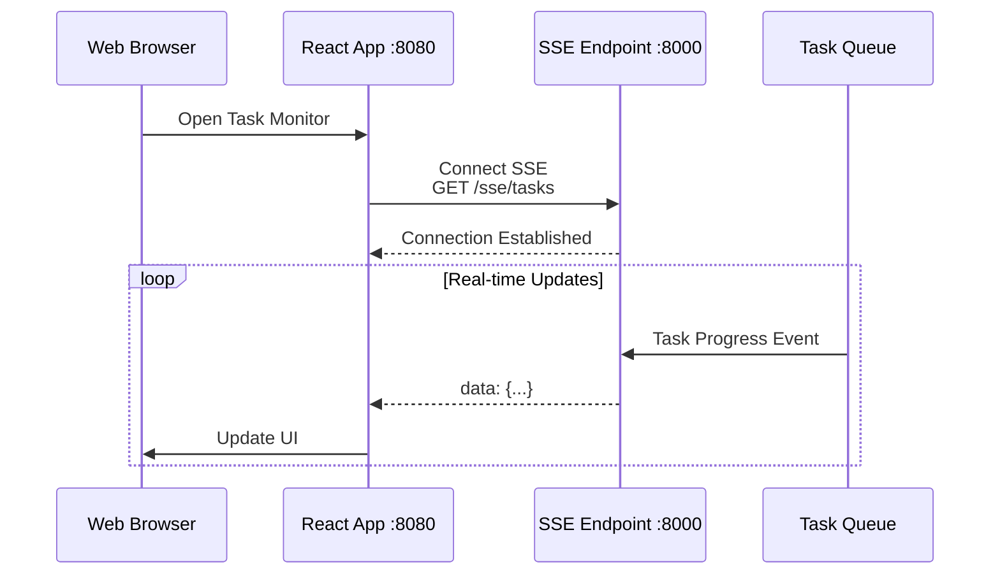
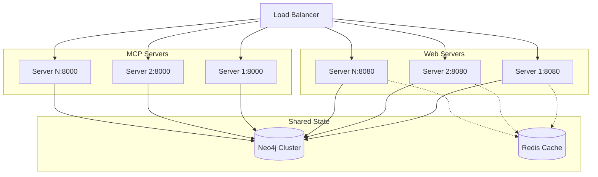

# Architecture Overview

## Introduction

Code Graph Knowledge System is a **hybrid intelligence platform** that serves both human users and AI agents through multiple interfaces. This document explains the system architecture, deployment modes, and how different components work together.

## System Architecture

### Dual-Server Design

The system operates on **two independent ports**, each serving different purposes:



### Port 8000: MCP SSE Service

**Purpose**: AI assistant integration and real-time communication

**Components**:
- **MCP Protocol Server**: stdio-based communication for AI tools
- **SSE Endpoint** (`/sse`): Server-Sent Events for real-time updates
- **Message Endpoint** (`/messages/`): Async message handling

**Primary Users**:
- AI assistants (Claude Desktop, Cursor, etc.)
- Development tools with MCP support

**Key Features**:
- 25+ MCP tools for code intelligence
- Real-time task monitoring via SSE
- Bi-directional communication with AI agents

### Port 8080: Web UI + REST API

**Purpose**: Human interaction and programmatic access

**Components**:
- **React Frontend**: Task monitoring, file upload, batch processing
- **REST API** (`/api/v1/*`): Full HTTP API for all system features
- **Prometheus Metrics** (`/metrics`): System health and performance

**Primary Users**:
- Developers (via web browser)
- System administrators
- External applications (via HTTP API)
- CI/CD pipelines
- Custom integrations

**Key Features**:
- Visual task monitoring dashboard
- Document upload and management
- System configuration and health monitoring
- Programmatic API access

---

## Understanding the REST API

### What is the REST API?

The REST API provides **HTTP-based programmatic access** to all system capabilities. It allows external applications, scripts, and services to interact with the knowledge system without requiring MCP protocol support.

### Why Do We Need REST API?

While MCP protocol serves AI assistants, REST API enables broader integration scenarios:

#### 1. **System Integration**
Connect Code Graph with existing enterprise tools:



**Example**: Automatically analyze code on every commit:
```yaml
# .github/workflows/analyze.yml
- name: Analyze Code
  run: |
    curl -X POST http://code-graph:8080/api/v1/ingest/repo \
      -H "Content-Type: application/json" \
      -d '{"local_path": ".", "mode": "incremental"}'
```

#### 2. **Custom Application Development**

Build your own interfaces on top of Code Graph:

```javascript
// Internal chatbot
async function askCodeQuestion(question) {
  const response = await fetch('http://code-graph:8080/api/v1/knowledge/query', {
    method: 'POST',
    headers: { 'Content-Type': 'application/json' },
    body: JSON.stringify({ question, mode: 'hybrid' })
  });
  return await response.json();
}
```

#### 3. **Automation and Scripting**

Automate repetitive tasks:

```python
# Daily documentation sync script
import httpx

async def sync_docs():
    # Upload latest docs to knowledge base
    response = await httpx.post(
        "http://code-graph:8080/api/v1/documents/directory",
        json={
            "directory_path": "/company/docs",
            "recursive": True
        }
    )
    return response.json()
```

#### 4. **Cross-Language Support**

Access from any programming language:

```go
// Go client
func searchCode(query string) ([]Result, error) {
    resp, err := http.Post(
        "http://code-graph:8080/api/v1/knowledge/search",
        "application/json",
        bytes.NewBuffer([]byte(fmt.Sprintf(`{"query":"%s"}`, query))),
    )
    // Parse and return results
}
```

### REST API vs MCP Protocol

| Feature | REST API | MCP Protocol |
|---------|----------|--------------|
| **Transport** | HTTP/HTTPS | stdio / SSE |
| **Format** | JSON over HTTP | JSON-RPC |
| **Client** | Any language | AI assistants |
| **Authentication** | API keys (future) | N/A |
| **Use Case** | System integration | AI context enhancement |
| **Examples** | curl, Python, JS | Claude Desktop |

**When to use REST API**:
- ✅ Integrating with CI/CD
- ✅ Building custom UIs
- ✅ Scripting and automation
- ✅ Cross-language access
- ✅ Webhook integrations

**When to use MCP Protocol**:
- ✅ AI assistant integration
- ✅ IDE plugin development
- ✅ Real-time AI interactions

---

## Deployment Modes

### Three Usage Scenarios

The system provides three startup modes for different scenarios:

#### 1. MCP Server Only (`codebase-rag-mcp`)

**Purpose**: AI assistant integration

**What it starts**:
- MCP protocol server (stdio)
- Direct communication with AI tools

**Use when**:
- Using with Claude Desktop
- Developing MCP-compatible tools
- AI-only workflows

**Example**:
```bash
# Start MCP server
codebase-rag-mcp

# Configure Claude Desktop
{
  "mcpServers": {
    "code-graph": {
      "command": "codebase-rag-mcp"
    }
  }
}
```

#### 2. Web Server (`codebase-rag-web`)

**Purpose**: Full-featured deployment for human users and applications

**What it starts**:
- Port 8000: MCP SSE service
- Port 8080: React frontend + REST API

**Use when**:
- Deploying for team usage
- Need visual monitoring
- Require programmatic access
- Production environments

**Example**:
```bash
# Start web server
codebase-rag-web

# Access:
# - Web UI: http://localhost:8080
# - REST API: http://localhost:8080/api/v1/
# - MCP SSE: http://localhost:8000/sse
```

#### 3. Complete Service (`codebase-rag`)

**Purpose**: Development and comprehensive deployment

**What it starts**:
- Everything from web server mode
- Full system capabilities
- All interfaces available

**Use when**:
- Local development
- Testing all features
- Production deployment with all services

---

## Component Architecture

### Backend Services

All backend services are shared across both ports:

#### 1. **Neo4j Knowledge Store**
- Graph database for code relationships
- Native vector index for semantic search
- Hybrid query engine

#### 2. **Task Queue**
- Asynchronous processing for heavy operations
- Real-time progress tracking
- Retry and error handling

#### 3. **Memory Store**
- Project knowledge persistence
- Decision and preference tracking
- Temporal knowledge management

#### 4. **Code Graph Service**
- Repository ingestion and analysis
- Symbol relationship tracking
- Impact analysis engine

### Frontend Components

#### React Web UI
- **Task Monitor**: Real-time progress visualization
- **Document Upload**: File and directory processing
- **System Dashboard**: Health and statistics
- **Configuration**: System settings management

Built with:
- **React** + **TanStack Router**: Modern SPA
- **TanStack Query**: Data fetching and caching
- **Tailwind CSS**: Responsive design
- **Recharts**: Data visualization

---

## Data Flow

### Typical Request Flows

#### AI Assistant Query Flow



#### REST API Request Flow



#### Real-time Monitoring Flow



---

## Technology Stack

### Backend
- **Python 3.13+**: Core runtime
- **FastAPI**: Web framework
- **Neo4j 5.x**: Graph database
- **LlamaIndex**: LLM integration framework
- **Prometheus**: Metrics and monitoring

### Frontend
- **React 18**: UI framework
- **TypeScript**: Type safety
- **Bun**: Package manager and bundler
- **TanStack Router**: Client-side routing
- **Tailwind CSS**: Styling

### Integration
- **MCP Protocol**: AI assistant communication
- **Server-Sent Events**: Real-time updates
- **REST API**: HTTP-based access

### Storage
- **Neo4j**: Primary data store
  - Document storage
  - Vector embeddings
  - Graph relationships
  - Memory persistence

---

## Scalability Considerations

### Horizontal Scaling

The system supports horizontal scaling:



### Performance Optimization

1. **Task Queue**: Offload heavy operations
2. **Caching**: Redis for frequently accessed data
3. **Connection Pooling**: Efficient database connections
4. **Incremental Processing**: Only process changed files

---

## Security Architecture

### Current Security Model

**Authentication**: Currently no authentication required (development mode)

**Network Security**:
- Bind to localhost by default
- Configurable host/port via environment variables

**Data Security**:
- No sensitive data storage by default
- User responsible for network security

### Future Enhancements

Planned security features:

1. **API Authentication**:
   - JWT token authentication
   - API key management
   - Role-based access control (RBAC)

2. **Data Encryption**:
   - TLS/HTTPS support
   - At-rest encryption for sensitive data

3. **Audit Logging**:
   - Request logging
   - Access tracking
   - Change history

---

## Summary

Code Graph Knowledge System is a multi-interface platform that serves:

1. **AI Assistants**: Via MCP protocol on port 8000
2. **Human Users**: Via React UI on port 8080
3. **External Systems**: Via REST API on port 8080

This architecture enables:
- ✅ Flexible deployment modes
- ✅ Broad integration possibilities
- ✅ Scalable multi-user support
- ✅ Real-time monitoring and feedback

Choose your deployment mode based on your needs:
- **MCP only**: AI assistant integration
- **Web server**: Team collaboration + API access
- **Complete service**: Full-featured deployment

For detailed API documentation, see [REST API Reference](../api/rest.md).
