# Cloudflare Setup Guide

This guide explains how to configure Cloudflare to serve the Code Graph documentation at `https://vantagecraft.dev/docs/code-graph/` using Transform Rules.

## Overview

The documentation is hosted on **GitHub Pages** (`royisme.github.io/codebase-rag/`) but served through **Cloudflare** at a custom path on your main domain. This provides:

- ✅ Better SEO (same domain as main site)
- ✅ Unified user experience
- ✅ Shared domain authority
- ✅ Easy management (GitHub Pages auto-deploys)

## Architecture

```mermaid
graph LR
    User[User Browser] -->|Request| CF[Cloudflare]
    CF -->|Transform URL| GHP[GitHub Pages<br/>royisme.github.io/codebase-rag]
    GHP -->|Response| CF
    CF -->|Rewrite URLs| User

    style CF fill:#f96332
    style GHP fill:#24292e
```



**Flow**:
1. User requests: `vantagecraft.dev/docs/code-graph/`
2. Cloudflare intercepts the request
3. Transform Rule rewrites to: `royisme.github.io/codebase-rag/`
4. GitHub Pages serves the content
5. User sees it at the vantagecraft.dev domain

## Prerequisites

- ✅ Domain managed by Cloudflare (`vantagecraft.dev`)
- ✅ GitHub Pages deployed for `codebase-rag` repository
- ✅ Cloudflare account with access to domain settings

## Configuration Steps

### Step 1: Verify GitHub Pages Deployment

Ensure documentation is accessible at the default GitHub Pages URL:

```bash
# Test GitHub Pages endpoint
curl -I https://royisme.github.io/codebase-rag/

# Should return 200 OK
```

### Step 2: Create Cloudflare Transform Rule

1. **Log in to Cloudflare Dashboard**
2. **Select your domain**: `vantagecraft.dev`
3. **Navigate to Rules**:
   - Left sidebar → **Rules** → **Transform Rules**
   - Click **Create rule**

4. **Configure the Transform Rule**:

#### Basic Settings

```
Rule name: Code Graph Docs Path Routing
```

#### When incoming requests match...

Select **Custom filter expression** and enter:

```
(http.host eq "vantagecraft.dev" and starts_with(http.request.uri.path, "/docs/code-graph"))
```

**Explanation**: Match all requests to `vantagecraft.dev/docs/code-graph/*`

#### Then rewrite to...

**Dynamic Path Rewrite**:

```
concat("/codebase-rag", regex_replace(http.request.uri.path, "^/docs/code-graph", ""))
```

**Explanation**:
- Remove `/docs/code-graph` prefix
- Add `/codebase-rag` prefix
- Example: `/docs/code-graph/guide/` → `/codebase-rag/guide/`

#### And override origin...

**Host Header Override**:

```
royisme.github.io
```

**Explanation**: Tell Cloudflare to fetch from GitHub Pages

### Step 3: Save and Deploy

1. Click **Deploy** button
2. Rule is active immediately

### Step 4: Verify Configuration

Test the setup:

```bash
# Test main page
curl -I https://vantagecraft.dev/docs/code-graph/

# Test subpage
curl -I https://vantagecraft.dev/docs/code-graph/getting-started/quickstart/

# Both should return 200 OK
```

**Browser test**:
```
https://vantagecraft.dev/docs/code-graph/
```

You should see the Code Graph documentation!

## Advanced Configuration (Optional)

### Add Caching Rules

Improve performance by caching documentation pages:

1. Navigate to **Rules** → **Page Rules** (or **Cache Rules**)
2. Create rule:

```
URL pattern: vantagecraft.dev/docs/code-graph/*

Settings:
- Cache Level: Standard
- Edge Cache TTL: 1 hour
- Browser Cache TTL: 30 minutes
```

### Add Security Headers

Add security headers for documentation:

1. Navigate to **Rules** → **Transform Rules** → **Modify Response Header**
2. Create rule:

```
When: http.request.uri.path starts with "/docs/code-graph"

Then add headers:
- X-Frame-Options: DENY
- X-Content-Type-Options: nosniff
- Referrer-Policy: strict-origin-when-cross-origin
```

### Custom 404 Page

Handle 404s gracefully:

1. Add another Transform Rule
2. If GitHub Pages returns 404, redirect to main docs page

## Troubleshooting

### Issue: 404 Not Found

**Symptom**: `vantagecraft.dev/docs/code-graph/` returns 404

**Solutions**:

1. **Verify GitHub Pages is working**:
   ```bash
   curl https://royisme.github.io/codebase-rag/
   ```
   Should return HTML content.

2. **Check Transform Rule syntax**:
   - Ensure no typos in the rule
   - Test with Cloudflare's rule tester

3. **Check DNS**:
   - Ensure domain is proxied through Cloudflare (orange cloud icon)

### Issue: Incorrect Redirects

**Symptom**: Pages redirect to wrong URLs

**Solutions**:

1. **Check regex pattern**:
   ```
   regex_replace(http.request.uri.path, "^/docs/code-graph", "")
   ```
   Make sure it's exact.

2. **Test with curl**:
   ```bash
   curl -v https://vantagecraft.dev/docs/code-graph/ 2>&1 | grep -i location
   ```

### Issue: CSS/JS Not Loading

**Symptom**: Page loads but styling is broken

**Solutions**:

1. **Check MkDocs configuration**:
   - Ensure `site_url` in `mkdocs.yml` is correct:
     ```yaml
     site_url: https://vantagecraft.dev/docs/code-graph/
     ```

2. **Rebuild and redeploy**:
   ```bash
   mkdocs build
   git add site/
   git commit -m "Rebuild with correct base URL"
   git push
   ```

### Issue: Transform Rule Not Working

**Symptom**: Requests not being transformed

**Solutions**:

1. **Check rule order**: Ensure this rule is at the top
2. **Verify rule is enabled**: Check the toggle switch
3. **Wait for propagation**: Rules can take 1-2 minutes to propagate
4. **Clear Cloudflare cache**:
   - Go to **Caching** → **Configuration**
   - Click **Purge Everything**

## Alternative: Subdomain Approach

If path-based routing doesn't work, you can use a subdomain:

### Option A: docs.vantagecraft.dev

1. Keep GitHub Pages default URL
2. Create CNAME: `docs.vantagecraft.dev` → `royisme.github.io`
3. Update `docs/CNAME` to:
   ```
   docs.vantagecraft.dev
   ```

### Option B: code-graph.vantagecraft.dev

Keep the current subdomain setup (no changes needed).

## SEO Considerations

### Path-based routing (Recommended)

```
URL: vantagecraft.dev/docs/code-graph/
```

**Pros**:
- ✅ Same domain authority
- ✅ Better for SEO
- ✅ Unified sitemap

**Cons**:
- ⚠️ Requires Cloudflare configuration

### Subdomain routing

```
URL: docs.vantagecraft.dev
```

**Pros**:
- ✅ Simpler setup
- ✅ Clear separation

**Cons**:
- ❌ Separate domain authority
- ❌ SEO isolation

## Verification Checklist

After configuration, verify:

- [ ] Main page loads: `https://vantagecraft.dev/docs/code-graph/`
- [ ] Subpages work: `https://vantagecraft.dev/docs/code-graph/getting-started/quickstart/`
- [ ] Search works
- [ ] Images load
- [ ] Navigation links work
- [ ] Edit links point to GitHub
- [ ] No infinite redirects
- [ ] HTTPS is enforced
- [ ] Response time < 1 second

## Monitoring

Monitor the setup:

```bash
# Check response time
curl -w "@-" -o /dev/null -s https://vantagecraft.dev/docs/code-graph/ <<'EOF'
time_total: %{time_total}s
http_code: %{http_code}
EOF

# Check if Cloudflare is caching
curl -I https://vantagecraft.dev/docs/code-graph/ | grep -i cf-cache-status
```

## Summary

You've configured Cloudflare to serve Code Graph documentation at:

**Public URL**: `https://vantagecraft.dev/docs/code-graph/`
**Backend**: GitHub Pages (`royisme.github.io/codebase-rag/`)
**Method**: Cloudflare Transform Rules

This provides:
- Better SEO through domain consolidation
- Automatic deployments via GitHub Actions
- Edge caching for performance
- Unified user experience

## Related Documentation

- [Deployment Overview](overview.md)
- [GitHub Actions Workflow](../development/release.md)
- [MkDocs Configuration](../development/contributing.md#documentation)

---

**Questions?** Open an issue on [GitHub](https://github.com/royisme/codebase-rag/issues).
