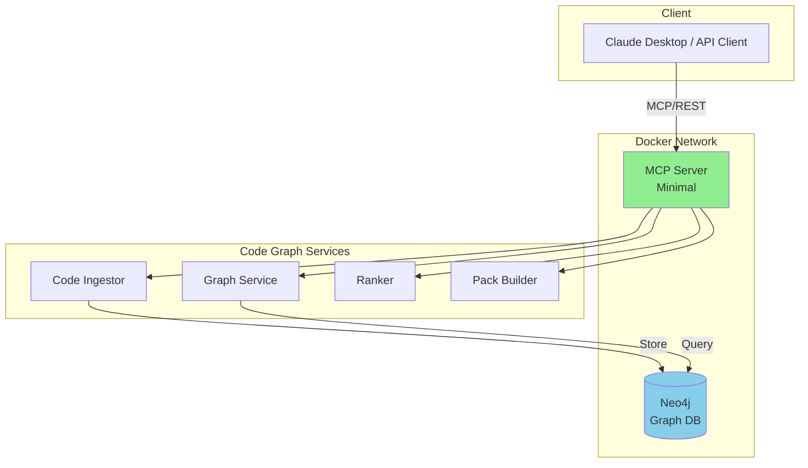
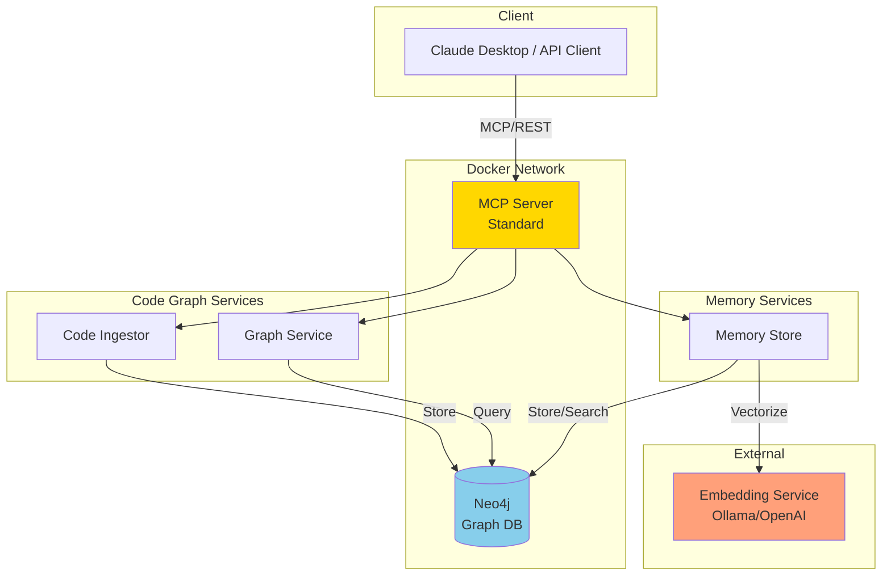
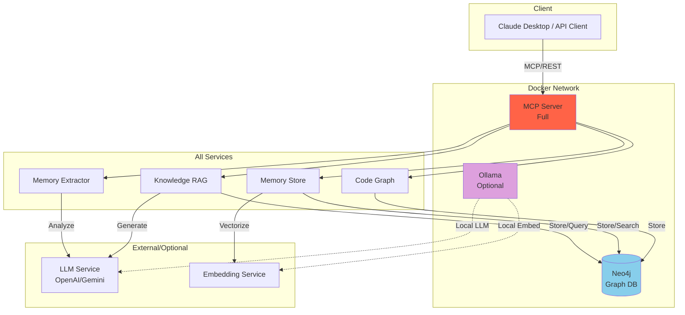
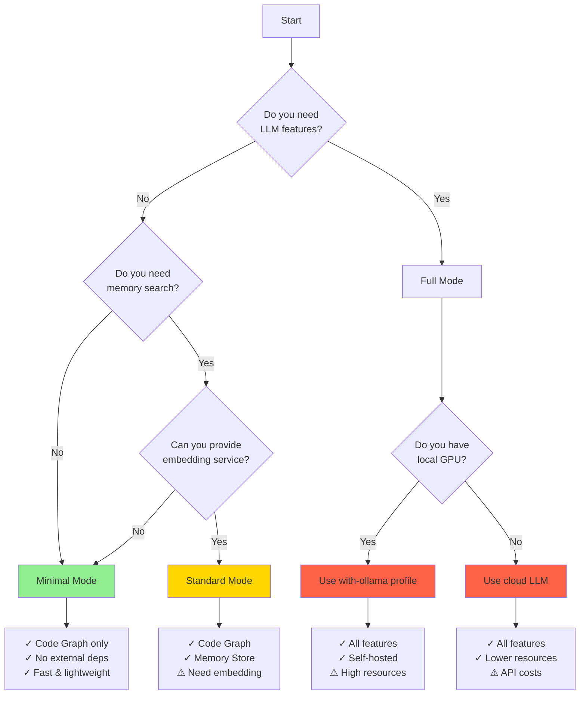

# Deployment Overview

Choose the right deployment mode based on your needs and available infrastructure.

## 🎯 Deployment Modes

### Minimal - Code Graph Only

**Perfect for**: Developers who want code intelligence without LLM overhead

```yaml
Requirements:
  - Neo4j database
  - Docker & docker-compose
  - No LLM needed ✓
  - No embedding model needed ✓

Resources:
  - Image size: ~500MB
  - Memory: ~1GB RAM
  - Startup time: ~5 seconds
```

**Available Features**:

- ✅ Repository ingestion and code parsing
- ✅ File relationship discovery (imports, dependencies)
- ✅ Impact analysis (who depends on this file?)
- ✅ Context packing for AI assistants
- ✅ Full-text search on file paths and content
- ❌ Memory Store
- ❌ Knowledge RAG
- ❌ Auto-extraction

**Use When**:

- You want code navigation and analysis only
- You don't need LLM-powered features
- You're working in air-gapped environments
- You want minimal resource usage

[→ Minimal Deployment Guide](minimal.md){ .md-button .md-button--primary }

---

### Standard - Code Graph + Memory

**Perfect for**: Teams building project knowledge bases

```yaml
Requirements:
  - Neo4j database
  - Docker & docker-compose
  - Embedding model (Ollama/OpenAI/Gemini) ✓
  - No LLM needed ✓

Resources:
  - Image size: ~600MB
  - Memory: ~2GB RAM
  - Startup time: ~8 seconds
```

**Available Features**:

- ✅ All Minimal features
- ✅ Manual memory management (add/update/delete)
- ✅ Vector-based memory search
- ✅ Project memory summaries
- ✅ Memory superseding (track decision changes)
- ❌ Auto-extraction from git/conversations
- ❌ Knowledge RAG

**Use When**:

- You want to maintain project decision logs
- You need searchable team knowledge
- You have access to an embedding service
- You prefer manual curation over auto-extraction

[→ Standard Deployment Guide](standard.md){ .md-button .md-button--primary }

---

### Full - All Features

**Perfect for**: Teams wanting complete AI-powered capabilities

```yaml
Requirements:
  - Neo4j database
  - Docker & docker-compose
  - LLM (Ollama/OpenAI/Gemini/OpenRouter) ✓
  - Embedding model ✓

Resources:
  - Image size: ~800MB
  - Memory: ~4GB RAM (+ LLM requirements)
  - Startup time: ~15 seconds
```

**Available Features**:

- ✅ All Standard features
- ✅ Automatic memory extraction from:
    - Git commits
    - AI conversations
    - Code comments (TODO/FIXME/NOTE)
    - Q&A sessions
- ✅ Knowledge base RAG:
    - Document ingestion
    - Intelligent Q&A
    - Multi-format support
- ✅ Batch repository analysis

**Use When**:

- You want fully automated knowledge extraction
- You need document Q&A capabilities
- You have LLM infrastructure available
- You want maximum AI assistance

[→ Full Deployment Guide](full.md){ .md-button .md-button--primary }

---

## 🔄 Mode Comparison Matrix

| Feature Category | Minimal | Standard | Full |
|------------------|---------|----------|------|
| **Code Graph** |
| Repository ingestion | ✅ | ✅ | ✅ |
| Incremental updates | ✅ | ✅ | ✅ |
| File search | ✅ | ✅ | ✅ |
| Impact analysis | ✅ | ✅ | ✅ |
| Context packing | ✅ | ✅ | ✅ |
| **Memory Store** |
| Add memory | ❌ | ✅ | ✅ |
| Search memories | ❌ | ✅ (vector) | ✅ (vector) |
| Update/delete | ❌ | ✅ | ✅ |
| Supersede | ❌ | ✅ | ✅ |
| Extract from git | ❌ | ❌ | ✅ (LLM) |
| Extract from chat | ❌ | ❌ | ✅ (LLM) |
| Extract from code | ❌ | ❌ | ✅ (LLM) |
| **Knowledge RAG** |
| Add documents | ❌ | ❌ | ✅ |
| Query knowledge | ❌ | ❌ | ✅ (LLM) |
| Vector search | ❌ | ❌ | ✅ |
| **Infrastructure** |
| Neo4j | Required | Required | Required |
| Embedding | - | Required | Required |
| LLM | - | - | Required |
| **Performance** |
| Image size | 500MB | 600MB | 800MB |
| RAM usage | 1GB | 2GB | 4GB+ |
| Startup time | 5s | 8s | 15s |

## 🏗️ Architecture Diagrams

### Minimal Mode Architecture



### Standard Mode Architecture



### Full Mode Architecture



## 🚀 Quick Decision Guide

Use this flowchart to choose your deployment mode:



## 📋 Pre-Deployment Checklist

### For All Modes

- [ ] Docker installed (version 20.10+)
- [ ] docker-compose installed (version 1.29+)
- [ ] At least 4GB free disk space
- [ ] Ports 7474, 7687, 8000 available
- [ ] `.env` file configured

### Additional for Standard Mode

- [ ] Embedding service available:
    - [ ] Local Ollama running, or
    - [ ] OpenAI API key, or
    - [ ] Google API key for Gemini

### Additional for Full Mode

- [ ] LLM service available:
    - [ ] Local Ollama running, or
    - [ ] OpenAI API key, or
    - [ ] Google API key, or
    - [ ] OpenRouter API key
- [ ] Embedding service (same as Standard)
- [ ] For local Ollama: GPU with 8GB+ VRAM (optional but recommended)

## 🔄 Switching Between Modes

You can switch deployment modes at any time. Data in Neo4j is preserved.

```bash
# Stop current deployment
make docker-stop

# Start different mode
make docker-minimal    # or
make docker-standard   # or
make docker-full
```

!!! warning "Configuration Required"
    When switching to Standard or Full mode, update your `.env` file with required API keys and service URLs.

## 📚 Next Steps

- [Minimal Deployment Guide](minimal.md)
- [Standard Deployment Guide](standard.md)
- [Full Deployment Guide](full.md)
- [Docker Guide](docker.md)
